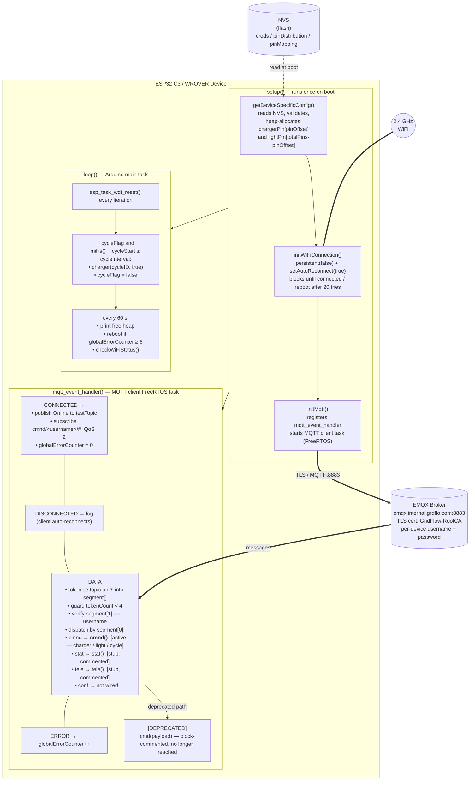

# GridFlow Microcontroller Firmware — Documentation

> **Status: Work in progress.** The core WiFi + MQTT infrastructure is functional. The `cmnd` handler is partially implemented (`charger` and `light` done, `cycle` pending). The `stat`, `tele`, and `conf` message handlers are stubs yet to be implemented.
>
> **Current dev-time behaviour:** Inside `MQTT_EVENT_DATA`, both the topic tokenisation block and the routed dispatch into `cmnd/stat/tele/conf` are presently commented out. Every incoming message is instead forwarded to the legacy `cmd(payload)` debug handler in `src/cmd.cpp`. The structured routing code stays in the file (alongside the `tokenCount < 3` guard) and is intended to be re-enabled once the handler set is finalised.

---

## Table of Contents

1. [Project Overview](#1-project-overview)
2. [Hardware](#2-hardware)
3. [Project Structure](#3-project-structure)
4. [Build Configuration — `platformio.ini`](#4-build-configuration--platformioini)
5. [Global Configuration — `config.h` / `config.cpp`](#5-global-configuration--configh--configcpp)
6. [Entry Point — `main.cpp`](#6-entry-point--maincpp)
7. [WiFi Utilities — `lib/wifiUtils/`](#7-wifi-utilities--libwifiutils)
8. [MQTT Manager — `src/mqttManager/`](#8-mqtt-manager--srcmqttmanager)
9. [Topic Routing — `src/functions/`](#9-topic-routing--srcfunctions)
10. [Debug Command Handler — `src/cmd.cpp`](#10-debug-command-handler--srccmdcpp)
11. [Architecture — How It All Fits Together](#11-architecture--how-it-all-fits-together)
12. [NVS Provisioning](#12-nvs-provisioning)
13. [MQTT Topic Structure](#13-mqtt-topic-structure)
14. [What Is Not Yet Implemented](#14-what-is-not-yet-implemented)

---

## 1. Project Overview

This is the firmware for a **GridFlow (GrdFlo) IoT node** running on an ESP32 microcontroller. The firmware is compatible with both the **ESP32-C3-DevKitM-1** and the **ESP32 WROVER** — the two boards are largely interchangeable for this firmware with the exception of the onboard RGB LED (see [Section 2](#2-hardware)). Development is currently being done on the **ESP32-C3**. The device:

- Connects to a WiFi network.
- Connects to the GridFlow MQTT broker (`emqx.internal.grdflo.com`) over **TLS** (port 8883), authenticating with a device-specific username and password.
- Receives commands and publishes status/telemetry through a structured MQTT topic hierarchy: `cmnd/`, `stat/`, `tele/`, and `conf/`.
- Controls a relay module (up to 16 channels) via GPIO — managing EV charging circuits and lighting circuits. The number of channels in use, the GPIO pin assignments, and the split between charger and light channels are all fully configurable at provisioning time. The same firmware binary runs on any hardware wiring configuration without recompilation.
- Stores all sensitive credentials and hardware configuration (WiFi SSID, WiFi password, device ID, MQTT password, pin assignments) in **ESP32 NVS** (Non-Volatile Storage), so they never appear in the firmware binary itself.

---

## 2. Hardware

### Supported Boards

The firmware runs on either of these two boards — they are interchangeable for all features except the onboard RGB LED:

| Board | MCU | Notes |
|---|---|---|
| **ESP32-C3-DevKitM-1** | ESP32-C3 (RISC-V, single-core) | Current development board. Has an onboard WS2812 RGB LED with **GRB** byte order. |
| **ESP32 WROVER** | ESP32 (Xtensa LX6, dual-core) | Production target option. Includes external SPI PSRAM. No LED connected for now. |

Each board has its own PlatformIO environment in `platformio.ini`. Switch between them by commenting/uncommenting the relevant `[env:...]` block. Both environments use the same pioarduino platform and the same source code.

### GPIO Pin Assignments

| Constant    | GPIO | Purpose                                   |
|-------------|------|-------------------------------------------|
| `LED_PIN`   | 10   | Addressable RGB LED (WS2812-type)         |
| `RED_PIN`   | 21   | External red indicator LED / output (currently parked on bricked pin) |
| `BLUE_PIN`  | 21   | External blue indicator LED / output (currently parked on bricked pin) |

All three constants are defined in `config.h`. These are fixed indicator and debug pins — not relay channels.

> **GRB quirk (ESP32-C3 only):** The onboard RGB LED on the ESP32-C3-DevKitM-1 uses **GRB** byte order instead of the usual RGB. The `rgbLedWrite()` calls in `cmd.cpp` account for this — the second argument is Green, third is Red, fourth is Blue. The WROVER has no LED connected, so `LED_PIN` and all LED-related code in `cmd.cpp` have no effect on that board for now.

> **Hardware note from pnv:** GPIO 21 on the original dev board is damaged. `RED_PIN` and `BLUE_PIN` are deliberately both pointed at 21 (`#define BLUE_PIN 21 // i know it is bricked`) so the legacy `cmd.cpp` debug commands cannot accidentally drive a working relay channel while the indicator-pin design is in flux.

### Relay Module

The device drives a relay module for controlling charging and lighting circuits. The channels are divided into two groups:

- **Charger pins** (`chargerPin[]`) — relay channels that switch EV charging or battery charging circuits.
- **Light pins** (`lightPin[]`) — relay channels that switch lighting circuits.

The total number of channels physically connected to GPIO (`totalPins`), the charger/light split (`pinOffset`), and the actual GPIO number for each channel are not hardcoded anywhere in the firmware. They are stored in NVS and loaded at boot. This means the supervisor's requirement — that pin count and pin assignments must be configurable without touching the firmware — is fully met. See [Section 5](#5-global-configuration--configh--configcpp) for the complete design.

---

## 3. Project Structure

```
grdflo-microcontroller/
│
├── platformio.ini                  # PlatformIO build + board configuration
│
├── src/                            # Main application source
│   ├── main.cpp                    # setup() and loop() — firmware entry point
│   ├── config.h                    # Global constants, pin defs, extern declarations
│   ├── config.cpp                  # Global variable definitions + NVS credential/pin loading
│   ├── cmd.h                       # Declaration for the debug cmd() function
│   ├── cmd.cpp                     # Debug command handler (LED/pin control via MQTT payload)
│   │
│   ├── mqttManager/
│   │   ├── mqttManager.h           # Public API: initMqtt(), mqttPublish()
│   │   └── mqttManager.cpp         # MQTT client setup, event handler, topic tokeniser
│   │
│   └── functions/                  # Handlers for each MQTT root topic
│       ├── cmnd/
│       │   ├── cmnd.h              # cmnd() + charger() declarations, extern cycleID
│       │   └── cmnd.cpp            # charger/light/cycle relay control + cycle globals
│       ├── stat/
│       │   └── stat.h              # Declaration for stat() handler — no .cpp yet
│       ├── tele/
│       │   └── tele.h              # Declaration for tele() handler — no .cpp yet
│       └── conf/
│           ├── conf.h              # Declaration for conf() handler
│           └── conf.cpp            # [STUB] Empty body; not yet wired into mqttManager
│
├── lib/                            # Project-private libraries (compiled separately by PlatformIO)
│   └── wifiUtils/
│       └── src/
│           ├── wifiUtils.h         # Declarations for WiFi helpers
│           ├── initWiFiConnection.cpp  # Blocking WiFi connect with reboot-on-failure
│           └── checkWiFiStatus.cpp     # Periodic WiFi health check + reconnect
│
├── include/                        # (Empty — reserved for shared project headers)
└── test/                           # (Empty — reserved for unit tests)
```

---

## 4. Build Configuration — `platformio.ini`

Two environments are defined — one per supported board. Activate the one you need by ensuring it is uncommented; comment out the other. Currently the **C3 is active and the WROVER is commented out**, reflecting active development on the C3.

**ESP32-C3-DevKitM-1 environment (current dev board):**
```ini
[env:esp32-c3-devkitm-1]
platform = https://github.com/pioarduino/platform-espressif32/releases/download/stable/platform-espressif32.zip
board = esp32-c3-devkitm-1
framework = arduino
monitor_speed = 115200
board_build.partitions = min_spiffs.csv
lib_deps = bblanchon/ArduinoJson@7.4.2
build_flags =
    -DARDUINO_USB_CDC_ON_BOOT=1
    -DARDUINO_USB_MODE=1
```

**ESP32 WROVER environment:**
```ini
[env:wrover]
platform = https://github.com/pioarduino/platform-espressif32/releases/download/stable/platform-espressif32.zip
board = esp32dev
framework = arduino
monitor_speed = 115200
lib_deps = bblanchon/ArduinoJson@7.4.2
board_build.partitions = min_spiffs.csv
build_flags = -DBOARD_HAS_PSRAM
```

### Key points

Settings common to both environments:

| Setting | Explanation |
|---|---|
| `platform = ...pioarduino...` | Uses the **pioarduino** fork of the ESP32 PlatformIO platform, which tracks newer ESP-IDF releases than the official Espressif platform package. |
| `framework = arduino` | Uses the Arduino-on-ESP-IDF layer. You can call standard `Arduino.h` functions AND drop into raw ESP-IDF APIs (like `esp_mqtt_client_*`, `esp_task_wdt_*`). |
| `monitor_speed = 115200` | Serial monitor baud rate — must match `Serial.begin(115200)` in `main.cpp`. |
| `board_build.partitions = min_spiffs.csv` | Partition table that allocates minimal space for SPIFFS, giving the application partition more flash. No filesystem is used here — all configuration lives in NVS. |
| `lib_deps = bblanchon/ArduinoJson@7.4.2` | Pins ArduinoJson to version 7.4.2. Included in `mqttManager.cpp` but not yet actively used — ready for JSON payload parsing in the handlers once implemented. |

Settings that differ between boards:

| Setting | C3 | WROVER | Why |
|---|---|---|---|
| `board` | `esp32-c3-devkitm-1` | `esp32dev` | Different board profiles for different MCUs. |
| `-DARDUINO_USB_CDC_ON_BOOT=1` | ✓ present | ✗ absent | The C3-DevKitM-1 uses USB CDC for serial output (no separate UART chip). The WROVER has a hardware UART, so this flag is not needed. |
| `-DARDUINO_USB_MODE=1` | ✓ present | ✗ absent | Same reason — puts the C3's USB peripheral into CDC/ACM mode. |
| `-DBOARD_HAS_PSRAM` | ✗ absent | ✓ present | Enables PSRAM support for the WROVER's external SPI RAM. Harmless on modules without PSRAM. |

---

## 5. Global Configuration — `config.h` / `config.cpp`

These two files together define all the **global state** of the device.

### `config.h` — Declarations

```cpp
#define RED_PIN      21
#define BLUE_PIN     21    // i know it is bricked
#define LED_PIN      10
#define MAX_SEGMENT   6
```

- `RED_PIN` / `BLUE_PIN` / `LED_PIN`: GPIO numbers for the indicator pins. Both indicator constants currently point at the bricked GPIO 21 — see [Section 2](#2-hardware) for the reason.
- `MAX_SEGMENT`: The maximum number of `/`-separated segments the firmware will parse from an incoming MQTT topic string. A topic like `cmnd/GF-B1/charger/0/cycle` has 5 segments; the upper bound of 6 accommodates the longest currently-routed form (`cmnd/<dev>/charger/<id>/cycle`).

The header also `extern`-declares every global variable that other `.cpp` files need to access:

```cpp
extern const char* ca_cert;            // TLS root certificate (PEM format)
extern unsigned int globalErrorCounter; // MQTT error count — triggers reboot at 5

extern String ssid;                    // WiFi network name — loaded from NVS
extern String wifiPassword;            // WiFi password — loaded from NVS

extern const char* brokerUri;          // MQTT broker URI
extern const char* testTopic;          // Dev/test MQTT topic ("test") used for the online announce
extern String username;                // Device ID — MQTT client ID and username
extern String password;                // MQTT password for this device

extern u8_t pinOffset;                 // How many of totalPins are charger channels
extern u8_t totalPins;                 // Total relay channels physically wired to GPIO
extern int *chargerPin;                // Dynamically allocated array of charger relay GPIO numbers
extern int *lightPin;                  // Dynamically allocated array of light relay GPIO numbers

extern unsigned long cycleInterval;    // Cycle-command duration in ms (set by cycle())
extern unsigned long cycleStart;       // millis() timestamp when cycle was armed
extern bool cycleFlag;                 // true while a cycle is in flight
```

**Why `extern`?** Without it, every `.cpp` file that includes `config.h` would create its own separate copy of each variable — multiple definitions of the same symbol. The linker would either error or silently give each file its own independent variable, meaning changes in one file would not be visible in another. `extern` separates the *declaration* (which goes in the header — "this variable exists somewhere") from the *definition* (which goes in a `.cpp` — "this is the one actual variable in memory"). Every file that includes `config.h` gets a reference to the same single underlying variable, with no duplication and no wasted memory.

**Where the definitions actually live.** Most of these globals are defined in `config.cpp`. The three cycle-related globals — `cycleInterval`, `cycleStart`, `cycleFlag` — are defined in `src/functions/cmnd/cmnd.cpp` alongside the `cycle()` function that owns them. They are still declared `extern` in `config.h` so `main.cpp` can read them in `loop()`. There is also a `cycleID` integer (the charger index currently being cycled) declared `extern` in `cmnd.h` and defined in `cmnd.cpp` — kept out of `config.h` because only `cmnd.cpp` and the loop's cycle-watcher need it.

**Why pointers for `chargerPin` and `lightPin`?** The size of these arrays is only known at boot time after reading `totalPins` and `pinOffset` from NVS. A fixed-size declaration like `int chargerPin[16]` would always allocate 16 integers regardless of how many relay channels are actually connected — wasting memory. Dynamic allocation with `new int[pinOffset]` and `new int[totalPins - pinOffset]` sizes them to exactly what this particular deployment needs.

### `config.cpp` — Definitions and NVS Loading

#### `ca_cert`

A **hardcoded PEM-encoded X.509 certificate** for the GridFlow internal Root CA (`GridFlow-RootCA`). The firmware embeds it so the TLS stack can verify the broker's identity without relying on any public CA store.

- Issuer/Subject: `GridFlow-RootCA`, country `NP`
- Valid: 2026-05-29 to 2036-05-26
- Self-signed CA certificate (CA:true) — GridFlow operates its own private PKI.

#### `brokerUri`

```cpp
const char* brokerUri = "mqtts://emqx.internal.grdflo.com:8883";
```

- `mqtts://` — MQTT over TLS.
- `emqx.internal.grdflo.com` — internal (private network) EMQX broker.
- Port `8883` — the standard MQTTS port.

#### `testTopic`

```cpp
const char* testTopic = "test";
```

Development placeholder used as the topic for the "Online" announce in `MQTT_EVENT_CONNECTED`. The real per-device control topic (see [Section 13](#13-mqtt-topic-structure)) is **already** built at runtime from `username` and subscribed to as `cmnd/<username>/#` — `testTopic` only remains for the boot-time online ping and will be removed once the `stat/` namespace is finalised.

#### `globalErrorCounter`

```cpp
unsigned int globalErrorCounter = 0;
```

Counts MQTT-level errors raised via `MQTT_EVENT_ERROR`. The 60-second tick in `loop()` checks this counter and reboots the device if it has reached 5, so a long-lived broker problem self-recovers without manual intervention. The counter is reset to 0 inside `MQTT_EVENT_CONNECTED`, so a successful reconnect after a transient error clears the error budget.

---

#### `getDeviceSpecificConfig()`

This is the most important function in this file. It reads all device-specific configuration out of NVS across three separate namespaces, validates everything, then allocates and populates the relay pin arrays. It runs once during `setup()` and reboots the device on any failure — a device with missing or invalid configuration cannot function, and a reboot loop makes the problem immediately visible on the serial monitor.

```cpp
void getDeviceSpecificConfig() {
    Preferences prefs;   // local variable — lives only for the duration of this function
    ...
}
```

`Preferences prefs` is declared as a **local variable** inside the function rather than as a global. It is only needed once during boot, so there is no reason to keep it in RAM for the entire lifetime of the device.

---

**Step 1 — Credentials (`creds` namespace)**

```cpp
prefs.begin("creds", true);

ssid         = prefs.getString("wifi_ssid", "readError");
wifiPassword = prefs.getString("wifi_pass", "readError");
username     = prefs.getString("dev_id",    "readError");
password     = prefs.getString("mqtt_pass", "readError");

prefs.end();
```

**NVS namespace `creds` — keys and meanings:**

| NVS Key     | Loaded into     | Meaning                                      |
|-------------|-----------------|----------------------------------------------|
| `wifi_ssid` | `ssid`          | WiFi network name                            |
| `wifi_pass` | `wifiPassword`  | WiFi password                                |
| `dev_id`    | `username`      | Device unique ID — also the MQTT client ID   |
| `mqtt_pass` | `password`      | MQTT password for this device on the broker  |

---

**Step 2 — Pin distribution (`pinDistribution` namespace)**

```cpp
prefs.begin("pinDistribution", true);
pinOffset = prefs.getUChar("offset",   255);
totalPins = prefs.getUChar("totalPin", 255);
prefs.end();
```

**NVS namespace `pinDistribution` — keys and meanings:**

| NVS Key    | Loaded into  | Meaning                                                      |
|------------|--------------|--------------------------------------------------------------|
| `offset`   | `pinOffset`  | How many of the connected relay channels are for charging    |
| `totalPin` | `totalPins`  | Total number of relay channels physically wired to GPIO      |

`totalPins` is the number of relay channels actually connected on this unit — the relay module supports up to 16 but a deployment might only wire up 4, 8, or any number. `pinOffset` is the split point within those connected channels: indices `0` to `pinOffset-1` go to the `chargerPin` array, indices `pinOffset` to `totalPins-1` go to `lightPin`.

**Why `getUChar` and not `getChar`?** `getChar` returns `int8_t` (signed, range -128 to 127). Passing `255` as the default would silently overflow to `-1` inside an `int8_t`. `getUChar` returns `uint8_t` (unsigned, range 0 to 255), so the default sentinel `255` is stored and returned correctly.

---

**Step 3 — Validation and reboot**

```cpp
if(ssid.compareTo("readError") == 0 || wifiPassword.compareTo("readError") == 0 ||
   username.compareTo("readError") == 0 || password.compareTo("readError") == 0 ||
   totalPins > 16 || pinOffset > totalPins) {
    Serial.println("Could not get appropriate read value from NVS...");
    delay(100);
    ESP.restart();
}
```

- Any credential string still equal to `"readError"` means the key was missing from NVS.
- `totalPins > 16` catches both the `255` not-found sentinel and any physically impossible value (the relay module only has 16 channels). Since `255 > 16` is true, a missing `totalPin` key always triggers a reboot — no separate sentinel check needed.
- `pinOffset > totalPins` catches a logically invalid configuration where more charger channels are declared than there are connected pins.

---

**Step 4 — Dynamic array allocation**

```cpp
chargerPin = new int[pinOffset];
lightPin   = new int[totalPins - pinOffset];
```

Arrays are sized at runtime to exactly what this deployment needs. A unit with `totalPins = 4` and `pinOffset = 2` allocates 4 integers total — 2 for chargers, 2 for lights — nothing wasted.

---

**Step 5 — Pin mapping (`pinMapping` namespace)**

```cpp
prefs.begin("pinMapping", true);

char tmp[2] = {0};

// Load charger GPIO numbers — NVS keys "A", "B", "C", ... for pinOffset entries
for(counter = 65; counter < (65 + pinOffset); counter++) {
    tmp[0] = (char)counter;
    tmp[1] = '\0';
    chargerPin[i] = prefs.getUChar(tmp, 255);

    if(chargerPin[i] == 255) { ... ESP.restart(); }
    pinMode(chargerPin[i], OUTPUT);
    i++;
}
i = 0;

// Light GPIO numbers — NVS keys continue from where charger left off, up to totalPins
for(counter; counter < (65 + totalPins); counter++) {
    tmp[0] = (char)counter;
    tmp[1] = '\0';
    lightPin[i] = prefs.getUChar(tmp, 255);

    if(lightPin[i] == 255) { ... ESP.restart(); }
    pinMode(lightPin[i], OUTPUT);
    i++;
}

prefs.end();
```

The actual GPIO numbers for each relay channel are stored in NVS under single-character keys. Starting from `"A"` (ASCII 65), each successive key maps to the next relay channel in order. Only `totalPins` keys need to exist — unused relay positions on the module do not need NVS entries.

**Why single-character keys?** NVS key names must be short (max 15 characters). Single characters are the most compact option and perfectly sufficient for up to 16 channels (`"A"` through `"P"`).

**How the two loops stay in sync:** The first loop ends with `counter = 65 + pinOffset`. The second loop starts from that value and ends at `65 + totalPins`. The number of iterations in the second loop is `(65 + totalPins) - (65 + pinOffset) = totalPins - pinOffset`, which is exactly the size of the `lightPin` array. The split point cancels out algebraically — no matter how `pinOffset` changes, the two loops together always cover exactly `totalPins` keys.

**NVS key mapping:**

| NVS Key range | Maps to | Contains |
|---|---|---|
| `"A"` to key at `64 + pinOffset` | `chargerPin[0]` … `chargerPin[pinOffset-1]` | GPIO numbers for charger relays |
| Key at `65 + pinOffset` to key at `64 + totalPins` | `lightPin[0]` … `lightPin[totalPins-pinOffset-1]` | GPIO numbers for light relays |

If any key returns the sentinel `255` (meaning the key doesn't exist), the device reboots. A partially provisioned pin map would silently drive the wrong GPIO pins — hard rebooting is far safer.

**Why NVS for all of this?** Hardcoding credentials and pin assignments in the firmware binary is a security and flexibility problem. The binary can be extracted from flash and read. Different hardware variants would require maintaining separate firmware builds. By storing everything in NVS (which supports per-device encryption via ESP32's eFuse-backed NVS encryption), every device has unique credentials and wiring without a firmware rebuild.

> The `nvs.csv` and `nvs.bin` files used to flash these values are intentionally **gitignored** (they contain real credentials and device-specific hardware config). See [Section 12](#12-nvs-provisioning).

---

## 6. Entry Point — `main.cpp`

This is the standard Arduino-style entry point with `setup()` (runs once on boot) and `loop()` (runs repeatedly).

### Watchdog Timer Setup

```cpp
esp_task_wdt_config_t wdt_cfg = {
  .timeout_ms     = 30000,
  .idle_core_mask = 0,
  .trigger_panic  = true
};
```

The **Task Watchdog Timer (TWDT)** is the firmware's self-recovery mechanism. If `loop()` ever gets stuck for more than **30 seconds** without calling `esp_task_wdt_reset()`, the watchdog fires and the device **panics and reboots**. `trigger_panic = true` produces a full ESP32 panic — it prints a register dump and stack trace to serial before rebooting, rather than silently resetting. This is invaluable for debugging hangs.

`esp_task_wdt_reconfigure()` applies this config, and `esp_task_wdt_add(NULL)` subscribes the Arduino main task to the watchdog.

### `setup()`

Runs once on power-on / reset. Execution order matters here:

1. **`Serial.begin(115200)`** — Start serial output for debugging.
2. **`pinMode(RED_PIN/BLUE_PIN, OUTPUT)`** — Configure the two indicator GPIO pins as digital outputs.
3. **`esp_task_wdt_reconfigure() + esp_task_wdt_add(NULL)`** — Arm the watchdog before any network calls that could potentially hang.
4. **`getDeviceSpecificConfig()`** — Load all credentials and pin mapping from NVS. Reboots on any failure.
5. **`delay(3000)`** — A 3-second pause letting hardware, the radio subsystem, and internal peripherals stabilise before making network calls.
6. **`initWiFiConnection(ssid, wifiPassword)`** — Connect to WiFi. Blocks until connected or reboots after 20 failed attempts.
7. **`initMqtt()`** — Start the MQTT client. After this, the device is fully online and the MQTT event handler drives all further behaviour.

### `loop()`

Runs continuously after `setup()`. It has two responsibilities — pet the watchdog and run two independent non-blocking timers:

```cpp
void loop() {
  esp_task_wdt_reset();
  unsigned long currMillis = millis();

  if(cycleFlag) {
    if((currMillis - cycleStart) >= cycleInterval) {
      Serial.printf("Cycle fired: charger %d re-enabling after %lu ms\n", cycleID, cycleInterval);
      charger(cycleID, true);
      cycleFlag = false;
    }
  }

  if((currMillis - prevMillis) >= interval) {
    prevMillis = currMillis;
    Serial.printf("Free heap: %d bytes\n", ESP.getFreeHeap());

    if(globalErrorCounter >= 5) {
      ESP.restart();
    }

    checkWiFiStatus(ssid.c_str(), wifiPassword.c_str());
  }
}
```

The `millis()` / timestamp pattern is a **non-blocking interval timer** — it avoids `delay()`, which would block the watchdog reset and eventually trigger a panic.

**Cycle re-enable block.** `cycleFlag` is set by `cycle()` in `cmnd.cpp` when a cycle command arrives. `cycle()` turns the targeted charger OFF, records `cycleStart = millis()` and the requested duration `cycleInterval` (in ms), and remembers which charger via `cycleID`. The loop then watches that timestamp: when `currMillis - cycleStart >= cycleInterval`, the charger is turned back ON and the flag is cleared. Unsigned subtraction makes this rollover-safe past the 49-day `millis()` wrap. Only one cycle can be in flight at a time — see [Section 9](#9-topic-routing--srcfunctions).

**60-second heartbeat.** Every minute the loop prints free heap (slow memory-leak detection), checks the error-counter budget, and calls `checkWiFiStatus()` to recover from WiFi loss.

**Error-counter reboot.** `globalErrorCounter` is incremented from `MQTT_EVENT_ERROR` in the MQTT task and reset to 0 from `MQTT_EVENT_CONNECTED`. If it crosses the threshold of 5 between two heartbeat ticks without a successful reconnect resetting it, the device hard-reboots via `ESP.restart()`. This is the application-layer self-recovery for cases where the MQTT client is producing errors but the WiFi link itself looks healthy.

---

## 7. WiFi Utilities — `lib/wifiUtils/`

This is a **project-private library** placed under `lib/` so PlatformIO compiles it as a separate static library. It provides two functions.

### `initWiFiConnection(ssid, password)` — `initWiFiConnection.cpp`

Blocking WiFi connection used at startup.

```cpp
WiFi.setAutoReconnect(true);   // ← must be before WiFi.begin()
WiFi.persistent(false);        // ← must be before WiFi.begin()
WiFi.begin(ssid, password);
```

Both settings are applied **before** `WiFi.begin()`. This matters:

- **`setAutoReconnect(true)`**: Tells the ESP32 WiFi driver to automatically attempt reconnection when the link drops, without any application-layer intervention. This is the primary reconnection mechanism. Setting it after `begin()` may not apply cleanly to the already-started connection.
- **`WiFi.persistent(false)`**: Prevents the WiFi library from writing the SSID/password to a second flash region on every `WiFi.begin()` call. Since credentials already live in NVS, writing them again is redundant and burns unnecessary flash write cycles. If called after `begin()`, the first call may have already written to flash.

The function then polls `WiFi.status()` in a loop — up to 20 attempts at 500 ms each (10 seconds total). Each failed attempt prints a `.` to serial so the progress is visible. If WiFi does not connect in time, the device **reboots** — there is no meaningful work it can do without network connectivity.

On success, the connected SSID and assigned IP address are printed to serial.

### `checkWiFiStatus(ssid, password)` — `checkWiFiStatus.cpp`

Called from `loop()` every 60 seconds as an **application-level WiFi watchdog**.

```cpp
void checkWiFiStatus(const char *ssid, const char *password) {
    if (WiFi.status() != WL_CONNECTED) {
        Serial.println("WiFi lost, reconnecting...");
        WiFi.disconnect();
        WiFi.begin(ssid, password);
    }
}
```

This is a safety net on top of `setAutoReconnect(true)`. If the driver-level reconnect fails or gets stuck in a bad state, this manually forces a fresh `WiFi.begin()`. The `Serial.println` before the reconnect attempt makes WiFi loss events clearly visible in the monitor log — without it, a silent reconnect would make it hard to correlate MQTT disconnections with WiFi drops.

---

## 8. MQTT Manager — `src/mqttManager/`

This is the heart of the firmware's connectivity layer. It uses the **ESP-IDF native MQTT client** (`esp_mqtt_client_*`) directly — not the Arduino PubSubClient library. The native client is more capable: it supports MQTT 5, QoS 0/1/2, TLS out of the box, message queuing (outbox), and runs on its own FreeRTOS task.

### `mqttManager.h` — Public API

```cpp
void initMqtt();
void mqttPublish(const char* pubTopic, const char *message, const int QoS, const int retain, const bool store);
```

- `initMqtt()`: Call once from `setup()`. Configures and starts the MQTT client.
- `mqttPublish()`: Used by the rest of the application to publish messages to the broker.

The commented-out `mqttSubscribe()` suggests dynamic per-topic subscription was considered — subscriptions are currently hardcoded inside `MQTT_EVENT_CONNECTED`.

### `mqttManager.cpp` — Implementation

#### `client`

```cpp
esp_mqtt_client_handle_t client;
```

A file-scope global handle to the MQTT client instance. Stored at file scope so both `mqtt_event_handler` and `mqttPublish` can access it without passing it around.

---

#### `initMqtt()`

Builds the MQTT client configuration struct and starts the client:

```cpp
esp_mqtt_client_config_t mqtt_cfg = {};
mqtt_cfg.session.keepalive                        = 20;
mqtt_cfg.broker.address.uri                       = brokerUri;
mqtt_cfg.credentials.client_id                    = username.c_str();
mqtt_cfg.credentials.username                     = username.c_str();
mqtt_cfg.credentials.authentication.password      = password.c_str();
mqtt_cfg.broker.verification.certificate          = ca_cert;
```

Key design decisions:

- **`client_id` == `username`**: The device ID serves double duty — it uniquely identifies the MQTT session AND authenticates it. The EMQX broker's ACL rules can use this to restrict each device to publishing and subscribing only on its own topics.
- **`keepalive = 20`**: The client sends a PINGREQ to the broker every 20 seconds of inactivity. The broker disconnects a client that goes silent for longer than `keepalive × 1.5 = 30 s`. This deliberately aligns with the 30-second watchdog timeout — if the device hangs and the watchdog fires, the broker will also notice the silence and mark the device offline.
- **`ca_cert`**: Passed directly to the ESP-IDF TLS stack. The stack verifies the broker's certificate chain against this CA. If verification fails, the connection is refused — no MITM possible.

**Commented-out Last Will block:**

```cpp
// mqtt_cfg.session.last_will.topic   = "test";
// mqtt_cfg.session.last_will.msg     = "{\"status\":\"offline\"}";
// mqtt_cfg.session.last_will.msg_len = 0;   // 0 -> strlen
// mqtt_cfg.session.last_will.qos     = 1;
// mqtt_cfg.session.last_will.retain  = 1;
```

This is the **MQTT Last Will and Testament (LWT)**. When configured, the broker automatically publishes this message if the client disconnects unexpectedly (power loss, crash, network failure). It is the standard IoT pattern for device presence detection — the cloud knows the device went offline without the device having to explicitly say so. It is commented out because the final `stat/` topic structure is not yet finalised.

---

#### `mqtt_event_handler()`

This is a **FreeRTOS event handler callback** — it runs on the MQTT client's internal FreeRTOS task whenever an MQTT event occurs. The handled events:

**`MQTT_EVENT_CONNECTED`**

```cpp
Serial.println("Connected to GridFlow EMQX Server");
esp_mqtt_client_enqueue(client, testTopic, "GF-KD1-Test --> Online", 0, 0, 0, true);
String cmndTopic = "cmnd/" + username + "/#";
esp_mqtt_client_subscribe(client, cmndTopic.c_str(), 2);
globalErrorCounter = 0;
```

When the client successfully connects to the broker:
1. Prints a confirmation to serial.
2. Publishes a retained "Online" announcement to the dev `testTopic` ("test").
3. Builds the per-device wildcard subscription `cmnd/<username>/#` at runtime and subscribes at QoS 2 (exactly-once delivery). This catches every `cmnd/<this-device>/...` topic the broker routes to it, including the future `cycle` subtopics.
4. Resets `globalErrorCounter` to 0 — a successful (re)connect clears the error budget that drives the auto-reboot in `loop()`.

A separate `conf/` subscription is still TODO — `conf.h` is not yet wired into the dispatcher.

**`MQTT_EVENT_DISCONNECTED`**

Prints `"Disconnected from broker (auto-reconnecting...)"`. The ESP-IDF MQTT client handles reconnection automatically — no manual reconnect code needed here.

**`MQTT_EVENT_SUBSCRIBED`**

Prints the message ID from the broker's SUBACK, confirming the subscription was accepted.

**`MQTT_EVENT_DATA`** — Incoming message handling.

This is the structured router. The topic is tokenised on `/` into a fixed-size `segment[]` array, the device-ID is verified, and the message is dispatched to the per-root handler. The legacy `cmd(payload)` debug call now lives in a `/* ... */` block beneath the router and is no longer reached.

```cpp
case MQTT_EVENT_DATA: {
    Serial.printf("Message Received in topic %.*s: ", event->topic_len, event->topic);
    Serial.printf("%.*s\n", event->data_len, event->data);

    char topic[event->topic_len + 1];
    memcpy(topic, event->topic, event->topic_len);
    topic[event->topic_len] = '\0';

    char *segment[MAX_SEGMENT];
    size_t tokenCount = 0;
    char *savePtr;
    char *token = strtok_r(topic, "/", &savePtr);
    while(token != NULL && tokenCount < MAX_SEGMENT) {
        segment[tokenCount++] = token;
        token = strtok_r(NULL, "/", &savePtr);
    }

    if (tokenCount < 4) return;

    char payload[event->data_len + 1];
    memcpy(payload, event->data, event->data_len);
    payload[event->data_len] = '\0';

    if(strcmp(segment[1], username.c_str()) == 0) {
        if(strcmp(segment[0], "cmnd") == 0) cmnd(segment, tokenCount, payload);
        // if(strcmp(segment[0], "stat") == 0) stat(segment, tokenCount, payload);
        // if(strcmp(segment[0], "tele") == 0) tele(segment, tokenCount, payload);
    } else {
        Serial.println("Client ID Mismatch");
    }

    /*
    DEPRECIATED
    cmd(payload);
    */

    break;
}
```

**Why manual null-termination?** The ESP-IDF MQTT event struct gives you `event->topic` (a raw pointer) and `event->topic_len` (an integer length). The pointer points into an internal buffer that is **not** null-terminated. Standard C string functions like `strtok_r` and `strcmp` require null-terminated strings, so the code manually copies the data into local stack arrays and appends `'\0'`. The initial `Serial.printf` avoids this copy by using `%.*s`, which takes an explicit length instead of relying on a null terminator.

**Why `tokenCount < 4`?** Every valid routable topic has at least 4 segments — for `cmnd`, the structure is `cmnd/<dev>/<group>/<channelID>`, which is 4 tokens. Accessing `segment[3]` without proof that at least 4 segments were parsed would be reading uninitialised stack memory. The guard is intentionally a hard `< 4` (not `< 3`) because every currently-routed handler needs `segment[3]`. Handlers that need **more** than 4 segments (e.g. the cycle sub-command which uses `segment[4]`) must do their own additional length check inside the handler — see `cmnd.cpp:18` (`seg_len >= 5`).

**Topic routing logic:**
- `segment[0]` — the root namespace: `cmnd`, `stat`, `tele`, or `conf`.
- `segment[1]` — the device ID (verified against `username` to ensure this message is addressed to this device).
- `segment[2+]` — sub-topic levels passed to the handler for further dispatch.

Only the `cmnd` dispatch is currently live. `stat`/`tele` are present as commented lines so they can be activated as their handlers ship; `conf` is not wired up at all yet (its `#include` is missing and there is no dispatch line, not even commented).

**Device-ID filter is active.** Because the broker subscription is `cmnd/<this-device>/#`, the broker should never deliver a message addressed to another device. The `segment[1] == username` check is a defence-in-depth — if a misconfigured ACL or a wildcard subscription ever leaks another device's traffic to this client, the `Client ID Mismatch` log makes it visible.

**`MQTT_EVENT_ERROR`**

```cpp
case MQTT_EVENT_ERROR:
    Serial.println("MQTT_EVENT_ERROR");
    globalErrorCounter++;
    break;
```

Prints `"MQTT_EVENT_ERROR"` and bumps `globalErrorCounter`. The actual error reason (TLS failure, connection refused, socket error) is available in `event->error_handle` but is not yet extracted and logged. The error-counter feeds the 60-second auto-reboot check in `loop()` — see [Section 6](#6-entry-point--maincpp).

**`default`**

An explicit `default: break;` silently handles any other event IDs the client may emit.

---

#### `mqttPublish()`

```cpp
void mqttPublish(const char* pubTopic, const char *message, const int QoS, const int retain, const bool store) {
    esp_mqtt_client_enqueue(client, pubTopic, message, 0, QoS, retain, store);
}
```

A thin wrapper around `esp_mqtt_client_enqueue()`. Uses `enqueue` rather than `publish` — `enqueue` adds the message to the client's internal **outbox** (a persistent queue), which means:
- If the connection drops mid-publish, the message is retried automatically when the client reconnects.
- It is safe to call from any FreeRTOS task, not just the MQTT task itself.

The `0` for the `len` parameter tells the library to calculate the length via `strlen(message)` automatically.

---

## 9. Topic Routing — `src/functions/`

These four subdirectories define the four root-level MQTT namespaces. The `cmnd`/`stat`/`tele` naming convention mirrors **Tasmota's topic design**, a widely adopted IoT communication pattern. `conf` is a GridFlow-specific addition for runtime device configuration.

The four namespaces divide into two roles based on direction:

**Input channels — device subscribes, cloud publishes:**

| Namespace | Purpose |
|-----------|---------|
| `cmnd` | Commands to the device — turn relay channels on or off |
| `conf` | Runtime configuration — update device settings without re-flashing NVS |

**Output channels — device publishes, cloud subscribes:**

| Namespace | Purpose |
|-----------|---------|
| `stat` | Device health and status — free heap, WiFi RSSI, uptime, and similar diagnostics |
| `tele` | Sensor telemetry — data from physical sensors connected to the device (sensors not yet connected) |

Each namespace has a corresponding C function with the same signature:

```cpp
void cmnd(char *segment[], const size_t seg_len, const char *payload);
void stat (char *segment[], const size_t seg_len, const char *payload);
void tele (char *segment[], const size_t seg_len, const char *payload);
void conf (char *segment[], const size_t seg_len, const char *payload);
```

- `segment[]`: The full array of `/`-split topic segments. Handlers can inspect `segment[2]`, `segment[3]`, etc. for sub-topic routing.
- `seg_len`: How many segments were actually parsed. Always bounds-check against this before accessing the array.
- `payload`: The null-terminated message payload string.

### `cmnd/cmnd.cpp`

The topic structures for `cmnd` are:

```
cmnd/<device_id>/(charger|light)/<channelID>          # on/off
cmnd/<device_id>/charger/<channelID>/cycle            # timed off-then-on
```

`segment[2]` selects the relay group (`charger` or `light`). `segment[3]` is the zero-based channel index within that group — `0` through `pinOffset-1` for chargers, `0` through `totalPins-pinOffset-1` for lights. `segment[4]`, when present, selects a sub-command (currently only `cycle`).

`cmnd()` dispatches to one of three internal functions:

**`charger(int chargerID, bool state)`**
- Bounds-checks `chargerID >= pinOffset` and returns `-1` if out of range.
- Calls `digitalWrite(chargerPin[chargerID], HIGH/LOW)` based on `state`.
- Logs `Charger <id> (GPIO <n>) -> ON/OFF` to serial for every transition.
- Returns `0` on success.

**`light(int lightID, bool state)`**
- Bounds-checks `lightID >= (totalPins - pinOffset)` and returns `-1` if out of range.
- Calls `digitalWrite(lightPin[lightID], HIGH/LOW)` based on `state`.
- Logs `Light <id> (GPIO <n>) -> ON/OFF` to serial for every transition.
- Returns `0` on success.

Both `segment[3]` and `payload` are passed through `atoi()` at the call site — `segment[3]` is the channel index as a string (e.g., `"2"`), and `payload` is `"1"` or `"0"`. `atoi()` converts both to integers; the integer `0`/`1` then implicitly converts to `bool` for the `state` parameter.

> **Payload caveat:** `atoi()` returns 0 for any non-numeric string. So `"1"` → ON, `"0"` → OFF, but `"ON"` / `"OFF"` / `"on"` / `"off"` all parse as 0 and turn the relay OFF. Use numeric payloads only, or replace the `atoi()` parse with `strcmp()` / JSON if word-form payloads need to be supported.

Example: `cmnd/GF-B1/charger/1` with payload `1` closes charger relay 1 — sets `chargerPin[1]` HIGH.

**`cycle(unsigned int timeInSeconds, char *segment[])`** — timed off-then-on cycle for one charger channel. Used to drop and re-energise a charger after a fixed delay (e.g. to reset a downstream device or to throttle current draw).

- Topic: `cmnd/<dev>/charger/<id>/cycle`
- Payload: integer **seconds** (the delay between off and re-on). The payload is multiplied by 1000 to give the internal `cycleInterval` in ms.

The arming sequence inside `cycle()`:
1. Set `cycleFlag = true`.
2. Immediately call `charger(chargerID, false)` to drop the relay.
3. Record `cycleID = chargerID` and `cycleStart = millis()`.
4. Log `Cycle started: charger <id>, interval <ms> ms`.

The re-enable happens **outside** this function, in `main.cpp`'s `loop()`. The loop watches `cycleFlag` and, when `millis() - cycleStart >= cycleInterval`, re-energises the charger via `charger(cycleID, true)` and clears the flag. This split keeps `cycle()` non-blocking — the MQTT task returns immediately and the watchdog is unaffected even for long cycle durations.

Constraints to know about:
- **One cycle at a time.** `cycleFlag` / `cycleID` / `cycleStart` / `cycleInterval` are scalars, so a second cycle command (on any charger) while a first is in flight overwrites the first one's bookkeeping — the first charger never gets re-enabled. If concurrent cycles per channel are ever needed, these globals have to become per-channel arrays.
- **Cycle is only valid for chargers**, not lights. Sending `cmnd/<dev>/light/<id>/cycle` does not match the dispatch.
- **Guard tightness.** The handler accepts the cycle path when `seg_len >= 5`. A malformed `cmnd/<dev>/charger/<id>/cycle` with no payload (or a non-numeric payload) parses to a 0-ms cycle, which the loop will fire on the very next iteration — visible as an off-then-on flicker.

### `conf/conf.cpp`

Currently an **empty stub**. Intended for runtime configuration changes — for example, updating pin assignments or the charger/light split without re-flashing NVS.

> **Note on future sensor support:** When physical sensors are added to the device, their GPIO pin assignments will likely need to be added to the NVS provisioning system similarly to how `chargerPin` and `lightPin` are handled today. The `conf` handler and `getDeviceSpecificConfig()` will both need extending at that point.

### `stat/stat.h` and `tele/tele.h`

Both are **header-only declarations** with no `.cpp` implementation files yet. The sub-topic structures for these namespaces have not been designed yet and will be defined when the handlers are implemented.

---

## 10. Debug Command Handler — `src/cmd.cpp`

```cpp
void cmd(char *payload) { ... }
```

This is an **earlier, simpler command handler** that predates the structured `cmnd`/`stat`/`tele`/`conf` routing. It accepts a raw payload string and dispatches on it directly, with no topic-level routing.

| Payload      | Action |
|-------------|--------|
| `"reboot"`   | `ESP.restart()` — hard reboot |
| `"red"`      | Set onboard RGB LED to red (GRB order: `rgbLedWrite(LED_PIN, 0, 255, 0)`) |
| `"blue"`     | Set onboard RGB LED to blue |
| `"green"`    | Set onboard RGB LED to green |
| `"white"`    | Set onboard RGB LED to white (all channels max) |
| `"off"`      | Turn off the onboard RGB LED |
| `"rp"`       | Set `RED_PIN` (GPIO 20) HIGH |
| `"bp"`       | Set `BLUE_PIN` (GPIO 5) HIGH |
| `"gr"`       | Set both `RED_PIN` and `BLUE_PIN` HIGH |
| `"off_pin"`  | Set both `RED_PIN` and `BLUE_PIN` LOW |
| `"on_pin"`   | Set both `RED_PIN` and `BLUE_PIN` HIGH |

> **Current status:** The call `cmd(payload)` inside `MQTT_EVENT_DATA` is commented out. This function was used for quick hardware testing and has been superseded by the structured topic routing. It may be repurposed or removed.

> **GRB quirk:** The comment in the code explicitly warns: *"for some reason it is G R B instead of RGB so be careful."* The `rgbLedWrite()` Arduino helper accepts `(pin, r, g, b)` but the WS2812 LED on the ESP32-C3-DevKitM-1 uses GRB wire order. The calls compensate by swapping R and G: `rgbLedWrite(LED_PIN, 0, 255, 0)` produces red (not green) because the LED physically sees `G=0, R=255, B=0`.

---

## 11. Architecture — How It All Fits Together

The diagram below shows the three execution contexts inside the device (`setup()`, the Arduino `loop()` task, and the MQTT client FreeRTOS task), the external resources each one touches (NVS, WiFi, the broker), and which dispatch paths inside `MQTT_EVENT_DATA` are currently active vs. stubbed.



---

## 12. NVS Provisioning

NVS (Non-Volatile Storage) is an ESP32 key-value store in flash, in its own partition separate from the firmware. Before a device can be deployed, its NVS partition must be written with device-specific credentials and hardware configuration.

The typical workflow:

1. Create an `nvs.csv` file (gitignored) with rows for each key-value pair across all three namespaces:

   ```
   key,type,encoding,value
   creds,namespace,,
   wifi_ssid,data,string,MyWiFiNetwork
   wifi_pass,data,string,MyWiFiPassword
   dev_id,data,string,GF-B1
   mqtt_pass,data,string,MyMqttPassword
   pinDistribution,namespace,,
   totalPin,data,u8,4
   offset,data,u8,2
   pinMapping,namespace,,
   A,data,u8,0
   B,data,u8,1
   C,data,u8,2
   D,data,u8,3
   ```

   In this example: `totalPin = 4` (4 relay channels physically wired), `offset = 2` (channels A and B are chargers on GPIO 0 and 1; channels C and D are lights on GPIO 2 and 3). Only `totalPin` keys are needed in `pinMapping` — there is no need to provision relay positions that are not physically connected.

2. Use the `nvs_partition_gen.py` tool (from ESP-IDF) to produce `nvs.bin`:
   ```bash
   python nvs_partition_gen.py generate nvs.csv nvs.bin 0x6000
   ```

3. Flash `nvs.bin` to the NVS partition address using `esptool.py` or a PlatformIO custom target.

Both `nvs.csv` and `nvs.bin` are in `.gitignore` because they contain real WiFi credentials, MQTT passwords, and device-specific hardware configuration. They must never be committed.

### Complete NVS Key Reference

| Namespace | Key | Type | Meaning |
|---|---|---|---|
| `creds` | `wifi_ssid` | string | WiFi network name |
| `creds` | `wifi_pass` | string | WiFi password |
| `creds` | `dev_id` | string | Device unique ID — also used as MQTT client ID and username |
| `creds` | `mqtt_pass` | string | MQTT password for this device on the broker |
| `pinDistribution` | `totalPin` | u8 | Number of relay channels physically wired (1–16) |
| `pinDistribution` | `offset` | u8 | Number of those channels used for charging (0–totalPin) |
| `pinMapping` | `A` through `A+totalPin-1` | u8 | GPIO number for each relay channel in order |

---

## 13. MQTT Topic Structure

All topics follow the same top-level pattern:

```
<root>/<device_id>/<subtopic...>
```

Where:
- `<root>` is one of `cmnd`, `stat`, `tele`, `conf`
- `<device_id>` is `username` (= `dev_id` from NVS) — e.g., `GF-B1`
- `<subtopic...>` is one or more additional levels handled inside each routing function

The **segment array** passed to each handler maps as:

```
topic:    cmnd  /  GF-B1  /  charger  /  1
index:      0       1          2          3
```

So `segment[0]` = root, `segment[1]` = device ID, `segment[2+]` = action-specific path.

### `cmnd` topic structure

```
cmnd/<device_id>/(charger|light)/<channelID>          # on/off
cmnd/<device_id>/charger/<channelID>/cycle            # timed off-then-on
```

| Topic | Payload | Direction | Meaning |
|-------|---------|-----------|---------|
| `cmnd/GF-B1/charger/0` | `"1"` / `"0"` | Cloud → Device | Set charger relay 0 ON / OFF |
| `cmnd/GF-B1/charger/1` | `"1"` / `"0"` | Cloud → Device | Set charger relay 1 ON / OFF |
| `cmnd/GF-B1/light/0`   | `"1"` / `"0"` | Cloud → Device | Set light relay 0 ON / OFF |
| `cmnd/GF-B1/light/1`   | `"1"` / `"0"` | Cloud → Device | Set light relay 1 ON / OFF |
| `cmnd/GF-B1/charger/0/cycle` | `"<seconds>"` (e.g. `"5"`) | Cloud → Device | Drop charger 0, then re-energise after N seconds. Non-blocking. |

Payload semantics: numeric only. `atoi()` is used for parsing, so `"ON"`/`"OFF"` parse as 0 and turn the relay OFF — use `"1"`/`"0"` for on/off, and a positive integer for `cycle`.

### `stat`, `tele`, `conf` topic structure (not yet designed)

Sub-topic levels for these three namespaces will be defined when the handlers are implemented.

| Topic (placeholder) | Direction | Meaning |
|---------------------|-----------|---------|
| `stat/GF-B1/...` | Device → Cloud | Device health — free heap, WiFi RSSI, uptime |
| `tele/GF-B1/...` | Device → Cloud | Sensor telemetry (sensors not yet connected) |
| `conf/GF-B1/...` | Cloud → Device | Runtime configuration update |

---

## 14. What Is Not Yet Implemented

| Component | File | Status | Notes |
|-----------|------|--------|-------|
| `stat` handler | `src/functions/stat/` | Header only | No `.cpp` file; topic structure not yet designed; dispatch line in `mqttManager.cpp:63` is commented out, waiting for the handler |
| `tele` handler | `src/functions/tele/` | Header only | No `.cpp` file; sensors not yet connected; dispatch line at `mqttManager.cpp:64` is commented out |
| `conf` handler | `src/functions/conf/conf.cpp` | Empty stub | Function signature exists, body is empty |
| `conf` wiring into router | `mqttManager.cpp` | Not added | `conf.h` not yet `#include`d in `mqttManager.cpp` and no `conf()` dispatch line — not even commented |
| Per-channel cycle bookkeeping | `cmnd.cpp:7–10` | Single-slot only | `cycleFlag`/`cycleID`/`cycleStart`/`cycleInterval` are scalars — a second cycle command overwrites any in-flight cycle. Needs to become per-channel arrays if concurrent cycles are required |
| Cycle payload validation | `cmnd.cpp:18` | Loose | `seg_len >= 5` permits a cycle topic with no payload-seconds; `atoi()` parse falls through to 0 → instant flicker. Tighten to `seg_len >= 5 && atoi(payload) > 0` or use JSON when payload schema firms up |
| Last Will (LWT) | `mqttManager.cpp:96–101` | Commented out | Pending final `stat/` topic structure |
| `MQTT_EVENT_ERROR` detail | `mqttManager.cpp:77–80` | Minimal | Prints event name and increments `globalErrorCounter` — actual reason from `error_handle` not extracted |
| MQTT init null check | `mqttManager.cpp:103` | Missing | `esp_mqtt_client_init()` return value not checked for NULL |
| VLA stack allocation | `mqttManager.cpp:39, 57` | Present | `topic` and `payload` are variable-length stack arrays — valid as a GCC extension but fragile under large MQTT payloads. Fixed-size buffers with explicit size checks would be safer |
| WDT reset in WiFi loop | `initWiFiConnection.cpp:9` | Missing | The blocking connect loop does not call `esp_task_wdt_reset()` — safe now (10 s < 30 s WDT), but fragile if the timeout or attempt count is ever increased |
| `stat/` runtime topic | `mqttManager.cpp:20` | Placeholder | Boot "Online" announce still publishes to the dev `testTopic` (`"test"`) — must move to a `stat/<username>/online` topic once the `stat` namespace is designed |
| Telemetry publishing | — | Not started | Nothing published to `stat/` or `tele/` yet; planned for the 60-second `loop()` interval |
| Sensor support | — | Not started | `tele` is reserved for physical sensor data; pin mapping will need extending when sensors are added |
| OTA firmware update | — | Not started | Updates currently require physical USB access; ESP32 OTA support via `cmnd` is the planned approach |
| NVS encryption | — | Not started | Credentials currently stored in plaintext flash; ESP32 NVS encryption via eFuse-backed key is the production solution |

---

*End of documentation.*
