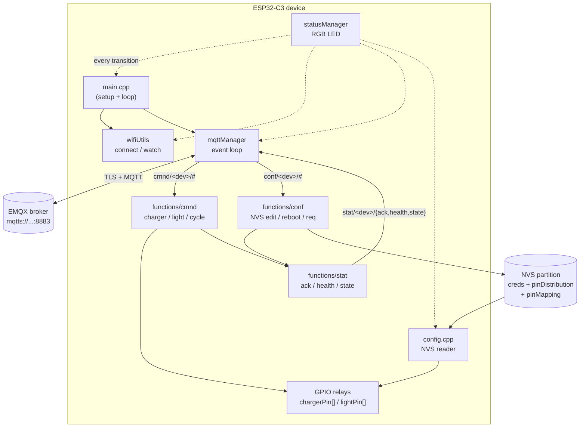
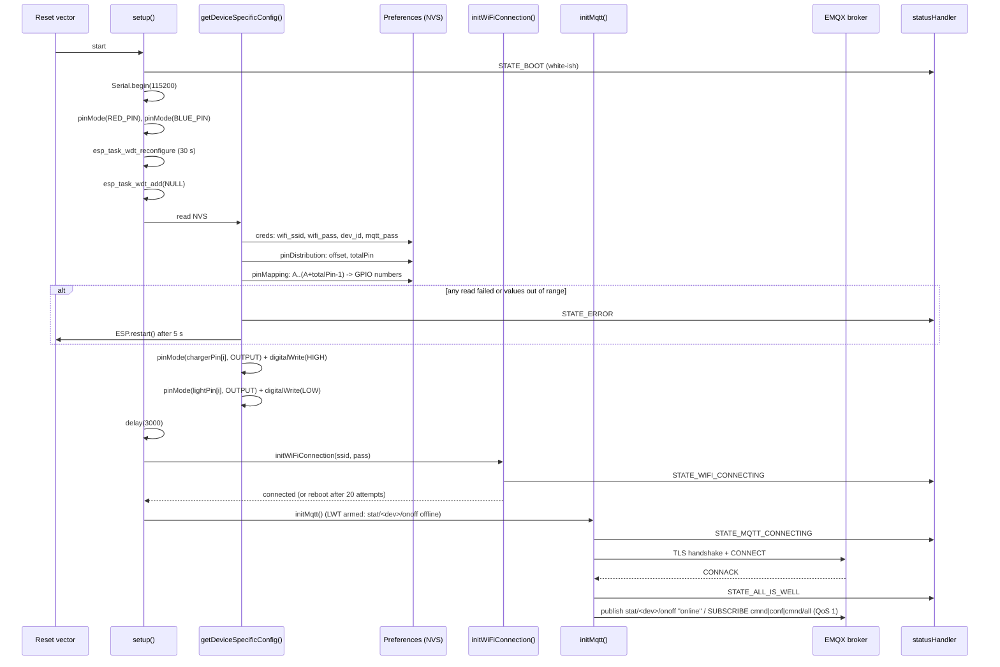
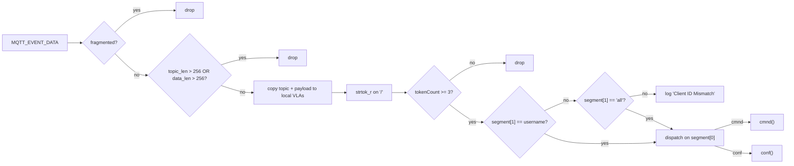
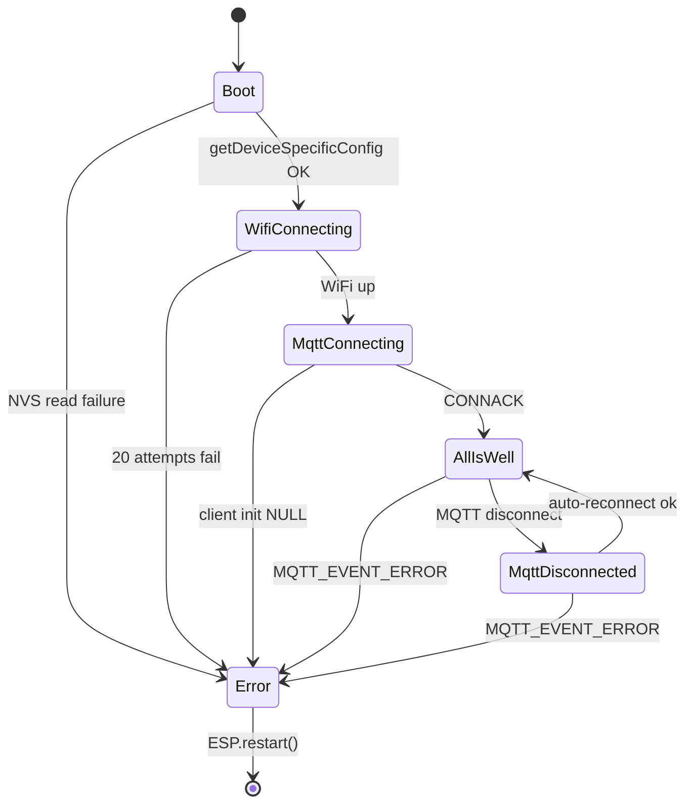
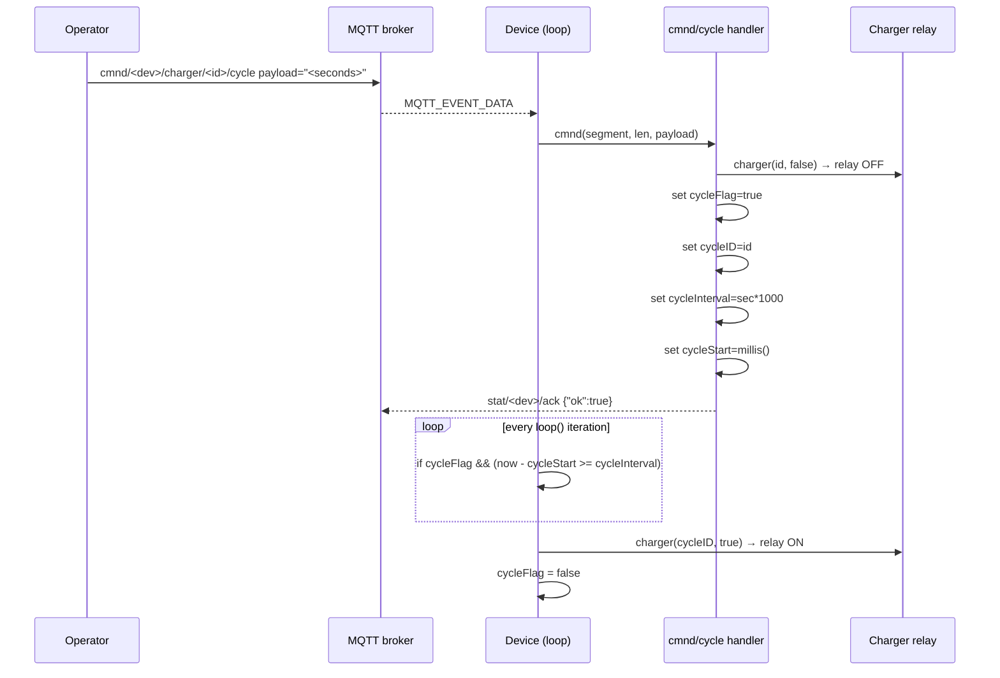

# grdflo-microcontroller

Firmware for the **GridFlow** edge controller — an ESP32-C3-based device that
drives a bank of relays (chargers + lights) over MQTT-TLS. The device pulls
its identity, WiFi credentials, broker credentials, and pin map from NVS at
boot, then connects to an EMQX broker and listens for routed commands.

> This document describes **what the code does today**, verified
> file-by-file. Open issues / open follow-ups are summarised in
> [Known limitations / TODOs](#known-limitations--todos).

---

## Table of Contents

1. [Overview](#overview)
2. [Hardware target & build configuration](#hardware-target--build-configuration)
3. [Architecture](#architecture)
4. [Project structure](#project-structure)
5. [Boot sequence](#boot-sequence)
6. [Configuration & NVS layout](#configuration--nvs-layout)
7. [MQTT topic structure & routing](#mqtt-topic-structure--routing)
8. [`cmnd/` — command handler](#cmnd--command-handler)
9. [`conf/` — runtime configuration](#conf--runtime-configuration)
10. [`stat/` — outgoing status messages](#stat--outgoing-status-messages)
11. [`tele/` — telemetry (placeholder)](#tele--telemetry-placeholder)
12. [Status LED](#status-led)
13. [WiFi management](#wifi-management)
14. [Watchdog & self-healing](#watchdog--self-healing)
15. [Cycle (timed re-enable)](#cycle-timed-re-enable)
16. [`nvs_partition_gen.py` — provisioning utility](#nvs_partition_genpy--provisioning-utility)
17. [Build, provision, and flash](#build-provision-and-flash)
18. [Extending the firmware](#extending-the-firmware)
19. [Known limitations / TODOs](#known-limitations--todos)

---

## Overview

Each device is a single ESP32-C3 module that:

- Reads its identity + WiFi/MQTT credentials + GPIO pin map from NVS.
- Connects to the EMQX broker at `mqtts://emqx.internal.grdflo.com:8883`
  using the embedded `GridFlow-RootCA` certificate.
- Subscribes to three topic patterns:
  - `cmnd/<dev_id>/#` — actionable commands for this device.
  - `conf/<dev_id>/#` — runtime config (NVS edits, health/state requests, reboot).
  - `cmnd/all/#`     — broadcast bus for the `light/all` flood pattern.
- Drives two GPIO classes — **chargers** (relay-controlled DC charge ports)
  and **lights** — addressed by zero-based channel index.
- Acknowledges every actioned command back on `stat/<dev_id>/ack`.
- Reports health and relay state on the 60 s heartbeat, and on demand on
  `stat/<dev_id>/health` and `stat/<dev_id>/state`.
- Publishes an `{"status":"online"}` boot announce on
  `stat/<dev_id>/onoff` and registers a retained `{"status":"offline"}`
  **Last Will** on the same topic so abrupt power loss is observable
  cloud-side.
- Self-heals via three independent paths: (a) five MQTT errors in a
  single heartbeat window force `ESP.restart()`; (b) WiFi disconnected
  for ≥ 3 minutes forces `ESP.restart()`; (c) the 30 s task watchdog
  panics a wedged `loop()`.

There is no `setup`-time AP, no captive portal, and no OTA. Devices are
**factory-provisioned** by flashing a pre-built NVS partition image generated
from `nvs.csv` via `nvs_partition_gen.py`.

---

## Hardware target & build configuration

| Setting | Value |
| --- | --- |
| Board | `esp32-c3-devkitm-1` |
| Framework | `arduino` |
| Platform | `pioarduino/platform-espressif32` (stable release) |
| Partition table | `min_spiffs.csv` (PIO built-in) |
| Serial monitor | `115200 baud` |
| USB CDC on boot | `-DARDUINO_USB_CDC_ON_BOOT=1` |
| USB mode | `-DARDUINO_USB_MODE=1` (USB-Serial JTAG / hardware CDC) |

A commented-out second environment (`[env:wrover]`, targeting `esp32dev` with
`-DBOARD_HAS_PSRAM`) is in `platformio.ini` but is **not** currently
maintained. The `-DARDUINO_USB_CDC_ON_BOOT=1` and `-DARDUINO_USB_MODE=1`
flags are C3-specific — they put the C3's native USB peripheral into
CDC/ACM mode (no separate UART chip on the dev board). The WROVER has a
hardware UART, so those flags are absent from the wrover env;
`-DBOARD_HAS_PSRAM` is its only differential build flag.

The pioarduino fork is used (rather than the official Espressif PlatformIO
platform) because it tracks newer ESP-IDF releases. No third-party
`lib_deps` are pulled in — the firmware uses only Arduino + ESP-IDF
(`esp_mqtt_client_*`, `esp_task_wdt_*`) APIs. An earlier
`bblanchon/ArduinoJson` pin was removed once it became clear that all
`stat/` payloads are small, fixed-shape strings built directly via
`snprintf` (see [`stat/` outgoing status messages](#stat--outgoing-status-messages)).

### Firmware version

`config.h` defines `FW_VERSION` (currently `1.0`) as a compile-time
constant. The value is embedded in every `stat/<dev>/health` payload so
the cloud can fingerprint the deployed firmware revision per device
without a separate identity probe.

### Relay contact logic (wiring polarity)

The relay module driven by this firmware is wired **active-low**:

- **GPIO `HIGH` → relay coil de-energised → NC (Normally Closed) contact connected.**
- **GPIO `LOW`  → relay coil energised   → NO (Normally Open) contact connected.**

Every `digitalWrite()` in `charger()` / `light()` and the boot-time
`digitalWrite(chargerPin[i], HIGH)` in `config.cpp` should be read with
that mapping in mind. The firmware never talks about "energised/closed"
in the abstract — it sets a GPIO level and the contact (NC vs NO) follows
from the wiring above.

Source: [`platformio.ini`](platformio.ini).

---

## Architecture



The device is single-threaded from a user-code perspective — `loop()` runs on
the Arduino main task; MQTT events fire via the IDF event loop and call back
into `mqtt_event_handler()` in `mqttManager.cpp`, which is what dispatches
into the `cmnd/` and `conf/` handlers synchronously.

---

## Project structure

```
grdflo-microcontroller/
├── platformio.ini             # PIO env definition
├── DOCUMENTATION.md           # this file
├── nvs.csv                    # NVS provisioning input (device-specific)
├── nvs.bin                    # NVS binary (generated; not committed)
├── nvs_partition_gen.py       # Espressif's NVS-image generator (vendored)
├── include/                   # (empty / PIO scaffolding only)
├── lib/                       # (empty / PIO scaffolding only)
├── test/                      # (empty / PIO scaffolding only)
└── src/
    ├── main.cpp               # setup() + loop()
    ├── config.h / config.cpp  # globals + NVS bootstrap
    ├── cmd.h / cmd.cpp        # DEPRECATED — entire file is commented out
    ├── mqttManager/
    │   ├── mqttManager.h
    │   └── mqttManager.cpp    # ESP-MQTT client + topic router
    ├── statusManager/
    │   ├── statusManager.h    # STATE_* enum + LED_PIN
    │   └── statusManager.cpp  # RGB LED driver
    ├── wifiUtils/
    │   ├── wifiUtils.h
    │   ├── initWiFiConnection.cpp
    │   └── checkWiFiStatus.cpp
    └── functions/
        ├── cmnd/              # action handler  (incoming)
        │   ├── cmnd.h
        │   └── cmnd.cpp
        ├── conf/              # config handler  (incoming)
        │   ├── conf.h
        │   └── conf.cpp
        ├── stat/              # status publisher (outgoing)
        │   ├── stat.h
        │   └── stat.cpp
        └── tele/              # telemetry        (placeholder; no .cpp yet)
            └── tele.h
```

Note: `src/cmd.h` and `src/cmd.cpp` are deprecated. Both files are entirely
commented out and exist only because `mqttManager.cpp` still carries a
`/* DEPRECIATED ... cmd(payload); */` comment block referring to the old
flat dispatcher. The MQTT manager no longer includes `cmd.h`.

---

## Boot sequence



Concrete order in `setup()` ([`src/main.cpp`](src/main.cpp:24)):

1. `statusHandler(STATE_BOOT)`.
2. `Serial.begin(115200)`.
3. `Serial.printf("BOOT TIME FREE HEAP: %d\n", ESP.getFreeHeap());` —
   first thing on the serial after the bootloader, makes it easy to spot
   memory regressions across firmware revisions.
4. Watchdog: `esp_task_wdt_reconfigure(&wdt_cfg)` (30 s, panic on
   timeout) then `esp_task_wdt_add(NULL)` to subscribe the current task.
5. `getDeviceSpecificConfig()` — reads NVS, allocates `chargerPin[]`,
   `lightPin[]`, `relayState[]`, drives boot-time charger HIGH and light
   LOW.
6. `delay(3000)` — wait for "all components to initialise, mainly WiFi
   related hardware, such that when we try to connect everything is on
   and running" (per the in-source comment, updated from the older
   "earlier testing" wording).
7. `initWiFiConnection(ssid.c_str(), wifiPassword.c_str())`.
8. `initMqtt()`.

Note: there are **no** `pinMode(RED_PIN, OUTPUT)` /
`pinMode(BLUE_PIN, OUTPUT)` calls in current `setup()` — the RED / BLUE
GPIOs are defined in `config.h` but never configured or written by any
runtime code path, consistent with the in-source `// i know it is
bricked` comment on `BLUE_PIN`.

Boot-time chargers are forced HIGH (`digitalWrite(chargerPin[i], HIGH)` in
`config.cpp:93`); lights are forced LOW
(`digitalWrite(lightPin[i], LOW)` in `config.cpp:113`). Both are
explicit — no relay channel is left at the GPIO's reset-time default.
Combined with the active-low wiring polarity:

- chargers boot **into the NC contact** (relay coil de-energised → load
  in its default-on state, the safe default for in-progress chargers
  surviving a device reboot)
- lights boot **into the NO contact** (relay coil de-energised → load
  off, the safe default for unattended illumination)

`relayState[]` is value-initialised to zero by `new int[totalPins]()`,
then the charger-init loop sets `relayState[i] = 1` for each charger
immediately after `digitalWrite(chargerPin[i], HIGH)`. Light entries
stay at the value-initialised `0`, which already matches the
`digitalWrite(lightPin[i], LOW)` electrical state, so the in-memory
mirror is consistent across both groups from boot.

---

## Configuration & NVS layout

All per-device configuration lives in NVS, split into three namespaces.
`getDeviceSpecificConfig()` ([`src/config.cpp:45`](src/config.cpp:45)) reads
them in order. The reference provisioning CSV is [`nvs.csv`](nvs.csv).

### Namespace `creds`

| Key         | Type   | Used by         | Notes |
| ----------- | ------ | --------------- | ----- |
| `wifi_ssid` | string | `initWiFiConnection`  | WiFi SSID |
| `wifi_pass` | string | `initWiFiConnection`  | WiFi PSK |
| `dev_id`    | string | `username` global → MQTT `client_id`/`username` and every topic | Per-device identity |
| `mqtt_pass` | string | `password` global → MQTT password | Broker auth |

If any of the four returns the sentinel `"readError"`, the device flashes
`STATE_ERROR`, prints a diagnostic, waits 5 s, and reboots.

### Namespace `pinDistribution`

| Key        | Type | Meaning |
| ---------- | ---- | ------- |
| `totalPin` | `u8` | Total number of relay channels driven by this device (max 16). |
| `offset`   | `u8` | Number of channels at the **front** of the table that are chargers. The remainder are lights. |

So a device with `totalPin=4, offset=2` has 2 chargers (channels 0–1) and 2
lights (channels 0–1 within the lights array, i.e. global table indices 2–3).

Sanity check (`config.cpp:63`): if `totalPins > 16` or `pinOffset > totalPins`,
the device flashes `STATE_ERROR` and reboots. Note that `getUChar` (not
`getChar`) is used so the sentinel `255` round-trips correctly — `getChar`
returns `int8_t` and would silently overflow `255` to `-1`. Since
`255 > 16`, a missing `totalPin` key is automatically caught by the same
upper-bound check; no separate sentinel test is needed.

### Namespace `pinMapping`

Each channel's GPIO number is stored under a single-letter ASCII key
starting at `'A'`. `nvs.csv` declares them in order:

```
A,data,u8,2     ← channel 0 (charger)
B,data,u8,3     ← channel 1 (charger)
C,data,u8,6     ← channel 2 (light index 0)
D,data,u8,7     ← channel 3 (light index 1)
```

The boot code iterates `counter = 65 .. 65 + totalPins - 1`, building the
single-character key from `counter` and reading the GPIO number for each
channel. Channels `[0 .. pinOffset)` go into `chargerPin[]`; the rest go
into `lightPin[]`. Any key that returns the sentinel `255` triggers
`STATE_ERROR` + reboot. Single-character keys are used because NVS keys
are capped at 15 characters and single ASCII characters are the most
compact option that still covers the 16-channel ceiling (`'A'` through
`'P'`).

The two loops stay in algebraic sync: the charger loop ends with
`counter = 65 + pinOffset`; the light loop starts from that value and
ends at `65 + totalPins`, so the second loop runs exactly
`totalPins - pinOffset` iterations — the size of `lightPin[]`. The split
point cancels out, so regardless of `pinOffset`, the two loops together
always cover exactly `totalPins` keys.

The three arrays (`chargerPin`, `lightPin`, `relayState`) are
**heap-allocated** rather than fixed-size for one reason: their size is
only known at boot after reading `totalPins`/`pinOffset` from NVS. A
fixed `int chargerPin[16]` would always allocate 16 ints regardless of
how many channels are physically wired. `relayState` uses `new int[totalPins]()`
— the trailing `()` value-initialises every element to zero. Charger
mirror entries occupy `relayState[0 .. pinOffset-1]`; light mirror
entries occupy `relayState[pinOffset .. totalPins-1]`. Writes happen
inside `charger()` and `light()` immediately after each `digitalWrite`,
so during normal operation the mirror stays in sync with the GPIO
levels — `statState()` then reads the mirror without having to
`digitalRead` every channel.

### Globals exposed in `config.h`

| Symbol | Source | Used by |
| ------ | ------ | ------- |
| `RED_PIN`, `BLUE_PIN` | `#define` (both `21`) | `main.cpp` (`pinMode` only) |
| `FW_VERSION` | `#define 1.0` | `stat.cpp::statHealth()` — embedded in every health payload |
| `MAX_SEGMENT` | `#define 6` | `mqttManager.cpp` topic tokeniser — upper bound on `/`-split tokens. The longest currently-routed form (`cmnd/<dev>/charger/<id>/cycle`) is 5 segments, so 6 leaves one slot of headroom |
| `ca_cert` | static literal | `mqttManager.cpp` (TLS) |
| `brokerUri` | static literal `mqtts://emqx.internal.grdflo.com:8883` | `mqttManager.cpp` |
| `ssid`, `wifiPassword`, `username`, `password` | NVS `creds` | WiFi + MQTT init |
| `pinOffset`, `totalPins` | NVS `pinDistribution` | All channel math |
| `chargerPin[]`, `lightPin[]`, `relayState[]` | Heap-allocated in `config.cpp` | `cmnd/`, `stat/` |
| `cycleID`, `cycleInterval`, `cycleStart`, `cycleFlag` | Set by `cycle()` in `cmnd.cpp`; read in `loop()` | Timed charger re-enable |
| `globalErrorCounter` | `mqttManager.cpp` (incremented in `MQTT_EVENT_ERROR`; reset in `MQTT_EVENT_CONNECTED`) | Reboot trigger in `loop()` |
| `WiFiDisconnectSince` | `checkWiFiStatus.cpp` (timestamp on first loss; cleared when reconnected) | 3-minute WiFi-loss reboot trigger in `loop()` |

---

## MQTT topic structure & routing

The `cmnd` / `stat` / `tele` root-namespace convention is taken from
**Tasmota** — a widely adopted naming pattern in the ESP IoT ecosystem.
`conf` is a GridFlow-specific addition for runtime device configuration
(NVS edits, snapshot pulls, reboot). The four namespaces split cleanly
by direction:

| Namespace | Direction | Purpose |
| --------- | --------- | ------- |
| `cmnd` | cloud → device (subscribed) | Actionable commands — toggle relays, run timed cycle |
| `conf` | cloud → device (subscribed) | Runtime config — NVS edits, health/state pulls, reboot |
| `stat` | device → cloud (published)  | Health, state snapshot, command ack |
| `tele` | device → cloud (placeholder) | Sensor telemetry — reserved, no implementation yet |

All four follow `<root>/<device_id>/<subtopic...>` where `<device_id>` is
the `username` string (= `dev_id` from NVS) or, for `cmnd` only, the
literal string `"all"` (fleet broadcast).

### MQTT client configuration (design notes)

The firmware uses the **ESP-IDF native MQTT client** (`esp_mqtt_client_*`)
directly — not Arduino PubSubClient. The native client supports MQTT
QoS 0/1/2, TLS out of the box, a persistent outbox, and runs on its own
FreeRTOS task. Key design choices in `initMqtt()`:

- **`keepalive = 30` s.** Client sends `PINGREQ` every 30 s of
  inactivity; broker disconnects a silent client after
  `keepalive × 1.5 = 45 s`. A 30 s keepalive is the practical lower
  bound under TLS on a flaky upstream — anything shorter risks the
  client spending a meaningful share of its time on ping handshakes
  instead of payload traffic. The 30 s task watchdog still fires before
  the broker times the device out, so a wedged `loop()` resets locally
  and the LWT publishes the offline state cloud-side after the
  subsequent broker timeout.
- **Last Will (LWT) enabled.** `mqtt_cfg.session.last_will.topic` is
  set to `stat/<dev>/onoff` with payload `{"status": "offline"}`,
  QoS 2, **retained**. The broker stores this and re-emits it the
  instant it concludes the client has gone away (TCP RST, keepalive
  timeout, or unclean disconnect). The matching `{"status": "online"}`
  publish at `MQTT_EVENT_CONNECTED` overwrites the retained value
  cleanly on every healthy reconnect. The `lastWillTopic` `String` is
  declared `static` inside `initMqtt()` because the IDF config struct
  stores the raw `const char *`, not a copy — a stack-local would
  dangle the instant `initMqtt()` returns.
- **TLS via `ca_cert`.** The embedded `GridFlow-RootCA` PEM is passed to
  the ESP-IDF TLS stack as `broker.verification.certificate`. The stack
  verifies the broker's certificate chain against this CA; verification
  failure refuses the connection.
- **`mqttPublish()` uses `esp_mqtt_client_enqueue()`, not
  `_publish()`.** `enqueue` adds the message to the client's internal
  outbox so (a) if the connection drops mid-publish, the message is
  retried automatically on reconnect, and (b) it is safe to call from
  any FreeRTOS task, not only the MQTT task itself. The `len = 0` arg
  tells the library to derive length via `strlen(message)`.

### Subscribed (at `MQTT_EVENT_CONNECTED`, [`src/mqttManager/mqttManager.cpp:20`](src/mqttManager/mqttManager.cpp:20))

| Topic filter         | QoS | Purpose |
| -------------------- | --- | ------- |
| `cmnd/<dev_id>/#`    | 1   | Actionable commands targeted at this device |
| `conf/<dev_id>/#`    | 1   | Runtime config (NVS edits, health/state requests, reboot) |
| `cmnd/all/#`         | 1   | Broadcast `cmnd` — every device on the broker receives this |

`<dev_id>` is the `username` string read from NVS (`dev_id` in the `creds`
namespace).

QoS for all three subscriptions was lowered from 2 to 1 in current
firmware: relay-control traffic is idempotent within the actuator's
acceptable error margin (commanding ON twice is identical to commanding
ON once), so the at-most-once duplicate suppression of QoS 2's PUBREC /
PUBREL handshake does not buy anything operationally, and the round
trips it adds matter on a slow upstream.

### Published

| Topic                    | Producer               | QoS | retain | When |
| ------------------------ | ---------------------- | --- | ------ | ---- |
| `stat/<dev_id>/onoff`    | `MQTT_EVENT_CONNECTED` | 2   | 1      | Single boot/reconnect announce: `{"status": "online"}` |
| `stat/<dev_id>/onoff`    | broker (Last Will)     | 2   | 1      | Re-emitted by broker on unclean disconnect: `{"status": "offline"}` |
| `stat/<dev_id>/ack`      | `statAck()`            | 1   | 0      | After every actioned `cmnd/` or `conf/edit/...` topic |
| `stat/<dev_id>/health`   | `statHealth()`         | 1   | 1      | (a) every 60 s heartbeat in `loop()`; (b) on `conf/<dev_id>/health` request |
| `stat/<dev_id>/state`    | `statState()`          | 1   | 1      | (a) every 60 s heartbeat in `loop()`; (b) on `conf/<dev_id>/state` request |

The `stat/<dev_id>/onoff` topic is the **device-presence channel**: the
broker holds the latest retained value on it, so any subscriber sees the
device's current up/down state on join without waiting for the next
heartbeat. The boot publish (QoS 2, retained) is symmetric with the LWT
so the topic always carries a current truth.

The `tele/` namespace is **planned** but not yet emitted; only the header
`functions/tele/tele.h` exists.

### Topic parsing

Inside `MQTT_EVENT_DATA` ([`src/mqttManager/mqttManager.cpp:43`](src/mqttManager/mqttManager.cpp:43)),
two upfront guards short-circuit malformed events **before** any copy or
tokenisation happens:

1. **Fragmented payload guard.** If
   `event->current_data_offset != 0` or
   `event->data_len != event->total_data_len`, the event represents only
   one fragment of a larger MQTT publish and is dropped (logged
   `"Fragmented MQTT message --> dropping"`). The router does not
   currently reassemble fragments — see [Known limitations](#known-limitations--todos).
2. **Oversize guard.** If `event->topic_len > 256` or
   `event->data_len > 256`, the event is dropped
   (`"Oversized topic or message length --> dropping"`). This is a
   defence against pathological payloads exhausting the VLA-based local
   buffers that the parser uses (`char topic[event->topic_len + 1]` and
   `char payload[event->data_len + 1]`).

After both guards, the incoming topic is split on `/` into at most
`MAX_SEGMENT = 6` tokens using `strtok_r`. The router enforces:

1. `tokenCount >= 3` — else the message is silently dropped. Every valid
   routable topic has at least 3 segments (`<root>/<dev>/<sub>`), so this
   bound permits the 3-segment `conf/<dev>/health`, `conf/<dev>/state`,
   `conf/<dev>/reboot` while keeping the dispatcher safe to index
   `segment[2]`. Handlers that need `segment[3]`/`[4]` do their own
   tighter check.
2. `segment[1]` must match `username` **or** the literal string `"all"`.
   The `"all"` form is what supports broadcast over `cmnd/all/#`. This
   is a **defence-in-depth** check — the broker subscriptions are
   `cmnd/<this-device>/#`, `conf/<this-device>/#`, and `cmnd/all/#`, so
   the broker should never deliver another device's traffic. If a
   misconfigured broker ACL ever leaks foreign traffic, the
   `Client ID Mismatch` log makes it visible.
3. Dispatch:
   - `segment[0] == "cmnd"` → `cmnd(segment, tokenCount, payload)`
   - `segment[0] == "conf"` → `conf(segment, tokenCount, payload)`
   - any other root namespace → no-op (`stat/`, `tele/` are publish-only).

**Manual null-termination.** The ESP-IDF MQTT event struct hands you
`event->topic` (a raw pointer into an internal buffer) plus
`event->topic_len` — the topic is **not** null-terminated. `strtok_r` /
`strcmp` both require null termination, so the handler copies the topic
and payload into local stack arrays and appends `'\0'` manually. The
initial `Serial.printf` avoids that copy by using `%.*s` (explicit
length). Both copies are variable-length stack arrays (VLAs) — fine as
a GCC extension but bounded to ≤ 256 bytes each by the oversize guard
above so stack pressure is predictable.



> Note: fragmented payloads are now **explicitly dropped** rather than
> mis-treated as complete — but the router does not reassemble them.
> Senders must keep individual publishes under the broker / TLS
> fragmentation threshold (which, for the topic shapes this firmware
> uses, is well under any path MTU concern).

### Operator cheat sheet — sample topics & payloads

For a device with `dev_id = GF-B1`, `totalPins = 4`, `pinOffset = 2`
(chargers 0–1, lights 0–1):

| Topic | Payload | Direction | Effect |
| ----- | ------- | --------- | ------ |
| `cmnd/GF-B1/charger/0` | `"1"` | cloud → device | Charger 0 ON (HIGH → NC contact, coil de-energised) |
| `cmnd/GF-B1/charger/1` | `"0"` | cloud → device | Charger 1 OFF (LOW → NO contact, coil energised) |
| `cmnd/GF-B1/light/0` | `"1"` | cloud → device | Light 0 ON |
| `cmnd/GF-B1/light/all` | `"0"` | cloud → device | Every light channel on **this device** OFF |
| `cmnd/GF-B1/charger/0/cycle` | `"30"` | cloud → device | Charger 0 OFF immediately, ON again 30 s later (payload **must be > 5 s** — see `cmnd/charger/cycle` below) |
| `cmnd/all/light/all` | `"1"` | cloud → **every device** | Fleet broadcast: every device turns all lights ON |
| `cmnd/all/light/0` | `"0"` | cloud → **every device** | Every device turns its light index 0 OFF |
| `cmnd/all/charger/...` | (any) | cloud → device | **Explicitly refused** by `cmnd()` — charger broadcasts are not supported |
| `conf/GF-B1/health` | (ignored) | cloud → device | Force an out-of-cycle `stat/GF-B1/health` publish |
| `conf/GF-B1/state` | (ignored) | cloud → device | Force a `stat/GF-B1/state` snapshot publish |
| `conf/GF-B1/reboot` | (ignored) | cloud → device | `ESP.restart()` — no ack (the next `stat/<dev>/onoff` `"online"` publish from `MQTT_EVENT_CONNECTED` is the indirect confirmation) |
| `conf/GF-B1/edit/creds/wifi_pass` | `"NewPassw0rd"` | cloud → device | NVS write; takes effect on next reboot — pair with `conf/GF-B1/reboot`. Ack `ok` mirrors the NVS `putString` return |
| `stat/GF-B1/onoff` | `{"status": "online"}` / `{"status": "offline"}` | device → cloud (retained, QoS 2) | Presence beacon (boot publish vs broker-emitted LWT) |
| `stat/GF-B1/health` | `{"heap":234560,"rssi":-52,"uptime_ms":873912,"err":0, "version": 1.000000}` | device → cloud (retained) | 60 s heartbeat or response to `conf/<>/health` |
| `stat/GF-B1/state` | `{"chargers":[0,1],"lights":[1,0]}` | device → cloud (retained) | 60 s heartbeat or response to `conf/<>/state` |
| `stat/GF-B1/ack` | `{"topic":"cmnd/GF-B1/charger/1","ok":true,"t":873912}` | device → cloud | Sent after every actioned `cmnd/` or `conf/edit/...` |

Payload semantics: numeric only. The handler uses `atoi()`, so only the
literal `"1"` turns a relay ON; `"on"` / `"ON"` / `"true"` all parse as
`0` and turn it OFF.

> `conf/all/...` is **explicitly refused** by the handler — broadcasts may
> only carry `cmnd/` actions, never `conf/` ones. Issuing
> `conf/all/reboot` would be a fleet-wide footgun.
>
> `cmnd/all/charger/...` is also explicitly refused inside the `cmnd()`
> handler. Fleet broadcasts cover lights only; chargers must always be
> addressed individually.

---

## `cmnd/` — command handler

Implementation: [`src/functions/cmnd/cmnd.cpp`](src/functions/cmnd/cmnd.cpp).

Entry point:

```cpp
void cmnd(char *segment[], const size_t seg_len, const char *payload);
```

`segment[0]` is always `"cmnd"`; `segment[1]` is either `<dev_id>` or `"all"`;
`segment[2]` is the action group.

`cmnd()` first asserts `seg_len >= 3` (defence-in-depth — the router already
enforced this). It then dispatches on `segment[2]`:

### `cmnd/<dev_id>/charger/<chargerID>` — single-channel toggle

**Broadcast guard.** The very first check inside the `charger` branch is
`if (strcmp(segment[1], "all") == 0) return;` — fleet-broadcast charger
commands are explicitly refused (no GPIO write, no ack). Only the
addressed-device form is honoured.

Payload is parsed by `atoi(payload)`: `"1"` → ON, `"0"` (or anything that
`atoi` parses to non-1) → OFF. The branch requires `seg_len >= 4`; otherwise
the call is silently dropped (no ack).

`charger(chargerID, state)`:

- Range check: `chargerID >= pinOffset || chargerID < 0` → return `-1`,
  no GPIO write. Both bounds are checked — negative IDs (e.g. an
  un-parsed `atoi` failure that returned `0` is still in range, but any
  explicit `"-1"` would be rejected) and out-of-range positive IDs are
  symmetric.
- ON: `digitalWrite(chargerPin[chargerID], HIGH)`, `relayState[chargerID] = 1`.
- OFF: `digitalWrite(chargerPin[chargerID], LOW)`, `relayState[chargerID] = 0`.

### `cmnd/<dev_id>/charger/<chargerID>/cycle` — timed re-enable

Topic shape: `cmnd/<dev_id>/charger/<chargerID>/cycle` (`seg_len >= 5` and
`segment[4] == "cycle"`).

Payload: integer seconds, `unsigned long`-wide (the `cycle()` signature
is `int cycle(unsigned long timeInSeconds, char *segment[])`, so very
long durations no longer overflow `unsigned int`).

**Minimum cycle duration is enforced.** Before invoking `cycle()`, the
dispatcher checks `atoi(payload) <= 5` and **bails silently** (no GPIO
write, no ack) if the requested duration is 5 seconds or shorter. The
floor exists so an accidental tiny cycle (e.g. `0`, `1`, the empty
string parsing to `0`) cannot rapidly re-toggle a power contactor —
sub-5-second relay flips are mechanically abusive and the de-bounce on
the cloud side is not always reliable.

On a valid call, `cycle()` immediately turns the charger OFF (via
`charger(chargerID, false)` — if that returns non-zero, e.g. for an
out-of-range `chargerID`, `cycle()` returns early with that status and
the eventual ack is `ok:false`). On success it sets `cycleFlag = true`,
`cycleID = chargerID`, `cycleInterval = payload * 1000`,
`cycleStart = millis()`. The re-enable is owned by the polling block in
`loop()` — see [Cycle (timed re-enable)](#cycle-timed-re-enable). Split
across two execution contexts keeps `cycle()` non-blocking — the MQTT
task returns immediately and the watchdog is unaffected even for long
cycle durations.

The ack for a `cycle` command therefore means **"cycle armed
successfully"**, not "cycle completed". The serial log line
`Cycle fired: charger N re-enabling after <ms> ms` (printed by `loop()`
when the timer expires) is the observable signal that the re-enable
actually happened.

Only **one** outstanding cycle is supported (single-slot bookkeeping). A
second `cycle` command before the first fires overwrites the existing
schedule — the first targeted channel never gets re-enabled.
`cycle` is only valid for chargers; `cmnd/<dev>/light/<id>/cycle` does
not match the dispatch.

### `cmnd/<dev_id>/light/<lightID>` — single-channel toggle

Same payload contract as charger. `light(lightID, state)`:

- Range check: `lightID >= (totalPins - pinOffset) || lightID < 0` →
  return `-1`. Both bounds, symmetric with `charger()`.
- Writes `lightPin[lightID]` and mirrors into `relayState[pinOffset + lightID]`.

### `cmnd/all/light` or `cmnd/<dev_id>/light/all` — broadcast light

Both forms are accepted. The handler iterates `i = 0 .. (totalPins - pinOffset - 1)`
and calls `light(i, atoi(payload))` for each. If **any** channel returns a
non-zero status, the final ack is `ok: false`; if all succeeded, `ok: true`.
There is no equivalent broadcast for the charger group.

### Acknowledgement

For every command that `cmnd()` dispatched (i.e. matched `charger` or
`light` and returned through the bottom of the function), it calls
`statAck(segment, seg_len, status == 0)`, which publishes to
`stat/<dev_id>/ack`. Unrecognised `segment[2]` values fall through the
`else { return; }` branch and **do not** ack — by design, we do not
confirm topics we silently dropped.

### Payload contract (current, undocumented elsewhere)

- ON  = literal `"1"`.
- OFF = literal `"0"` or anything else `atoi` parses to ≠ 1 (including the
  empty string and `"on"`/`"off"`).

> The `"on"`/`"off"` / `"true"`/`"false"` quirk is an open issue — see
> [Known limitations](#known-limitations--todos).

---

## `conf/` — runtime configuration

Implementation: [`src/functions/conf/conf.cpp`](src/functions/conf/conf.cpp).

Entry point:

```cpp
void conf(char *segment[], const size_t seg_len, const char *payload);
```

Guards:

- `seg_len >= 3` required (else drop).
- `segment[1] == "all"` is **explicitly refused**: broadcasts may only carry
  `cmnd/` actions, never `conf/` ones. Returns silently — no ack.

Dispatch on `segment[2]`:

| Subcommand | Topic                                    | Effect |
| ---------- | ---------------------------------------- | ------ |
| `health`   | `conf/<dev>/health`                       | Calls `statHealth()`; no ack (the published health doc *is* the response). |
| `state`    | `conf/<dev>/state`                        | Calls `statState()`; no ack. |
| `reboot`   | `conf/<dev>/reboot`                       | `ESP.restart()` immediately. |
| `edit`     | `conf/<dev>/edit/<namespace>/<key>`       | Writes `payload` to NVS at `[namespace][key]`. Currently only `namespace == "creds"` is implemented. Acks success. |

### Edit semantics

`conf/edit/...` accepts `seg_len >= 5` (i.e. namespace + key are present).
The handler opens NVS read-write on the named namespace, and **only** if
the key already exists (`pref.isKey(segment[4])`) writes the new string
value. The ack flag is now derived from `Preferences::putString`'s
return — `ok = (pref.putString(...) > 0)`. So an NVS write that didn't
actually persist any bytes (out-of-space, hardware failure) acks
`ok:false` instead of silently lying. Acks via
`statAck(segment, seg_len, ok)`. So:

- Adding a brand-new key over MQTT is **not** supported — the `isKey()`
  guard exists specifically to prevent accidentally creating arbitrary
  NVS keys from a topic typo.
- The new value is always a string — there is no path to write `u8` (the
  `pinDistribution`/`pinMapping` namespaces) over MQTT yet.
- WiFi/MQTT credential changes do **not** take effect until the next
  reboot — `WiFi.begin()` and `esp_mqtt_client_init()` are only called
  from `setup()`. The standard rotation playbook is to follow a
  `conf/<dev>/edit/creds/wifi_pass` with a `conf/<dev>/reboot`.

Example: publishing `"NewPassword"` to `conf/GF-B1/edit/creds/wifi_pass`
rewrites the NVS key and acks `ok:true` (assuming the write succeeded);
the new password is live after the operator publishes
`conf/GF-B1/reboot` (or the device reboots for any other reason).

> **Broker ACL security note.** `conf/<dev>/edit/#` can rewrite WiFi
> credentials, MQTT password, and the device ID. The broker ACL on this
> topic family must be **considerably tighter** than the ACL on
> `cmnd/<dev>/#` — only operators with rotation privileges should be able
> to publish to `conf/<dev>/edit/...`. Read-only operators only need
> publish access to `conf/<dev>/health` and `conf/<dev>/state`.

---

## `stat/` — outgoing status messages

Implementation: [`src/functions/stat/stat.cpp`](src/functions/stat/stat.cpp).

All `stat/` payloads are small fixed-shape JSON strings built directly with
`snprintf` — there is no JSON library dependency.

**QoS choice.** All three publishers (`statHealth`, `statState`,
`statAck`) call `mqttPublish(..., QoS=1, ...)`. QoS 1 is "at least
once"; duplicates may arrive on the subscriber side but the broker will
not silently drop. Given the payloads are idempotent JSON snapshots or
acks tagged with the original topic, the cloud subscriber can dedup
cheaply, and we save the round trips that QoS 2's PUBREC/PUBREL
handshake would otherwise add. The boot-announce on
`stat/<dev>/onoff` and the LWT (broker-side) are the only QoS 2
publishes — they're presence beacons, where double-publishing or
out-of-order delivery would meaningfully muddy the cloud's view of
device state.

**Retain choices.** `stat/<dev>/health` and `stat/<dev>/state` are
published with `retain=1` so a dashboard subscribing mid-stream
immediately sees the latest snapshot without waiting for the next
periodic publish. `stat/<dev>/ack` is **not** retained — each ack
describes a one-shot event in the past, so a freshly-subscribing client
being greeted with an hour-old ack would be misleading.

### `statHealth()` → `stat/<dev>/health` (QoS 1, retain)

```json
{"heap":<freeHeapBytes>,"rssi":<dBm>,"uptime_ms":<millis()>,"err":<globalErrorCounter>, "version": <FW_VERSION>}
```

The `version` field is a `%f`-formatted print of the `FW_VERSION`
compile-time macro (`1.0` today, rendered as `1.000000` because
`snprintf` defaults `%f` to 6 decimal places). Subscribers should
compare numerically rather than string-match.

Called from two places:

- `loop()` in `main.cpp` — every 60 s heartbeat.
- `conf()` when `segment[2] == "health"`.

### `statState()` → `stat/<dev>/state` (QoS 1, retain)

```json
{"chargers":[<state_0>,<state_1>,...],"lights":[<state_0>,<state_1>,...]}
```

Each entry is `0` or `1`, mirroring `relayState[]`. The split point is
`pinOffset`. Buffer is `char[256]` — comfortable for the 16-channel max.

Called from two places:

- `loop()` in `main.cpp` — every 60 s heartbeat (added in current
  firmware; previously this was on-demand only). Pairing it with the
  `statHealth()` tick gives the cloud an unsolicited relay-state
  snapshot at the same cadence as health metrics, so a long-lived
  dashboard does not need a separate poll to stay current after a
  retained-payload TTL elapses.
- `conf()` when `segment[2] == "state"`.

### `statAck()` → `stat/<dev>/ack` (QoS 1, retain=0, store=true)

Two overloads:

- `statAck(const char *originTopic, bool ok)` — used when the caller has
  already serialised the topic.
- `statAck(char *segment[], size_t seg_len, bool ok)` — reconstructs the
  original `/`-joined topic from the tokenised segments and forwards to the
  first overload.

Payload:

```json
{"topic":"<original topic>","ok":true|false,"t":<millis()>}
```

Producers:

- `cmnd()` — every actioned charger/light/cycle command.
- `conf()` — only the `edit` subcommand acks.

---

## `tele/` — telemetry (placeholder)

`src/functions/tele/tele.h` declares:

```cpp
void tele(char *segment[], const size_t seg_len, const char *payload);
```

No implementation exists. The `mqttManager.cpp` router does **not** include
`tele/` in its dispatch (the only roots routed are `cmnd` and `conf`), so
even if a device were subscribed to a `tele/<id>/#` topic, nothing in the
firmware would consume it. The current MQTT subscription list does not
include any `tele/...` filter.

Document marker only — treat as a TODO.

---

## Status LED

Defined in [`src/statusManager/statusManager.cpp`](src/statusManager/statusManager.cpp).
The LED is a single addressable RGB pixel on `LED_PIN = 10`, driven via
`rgbLedWrite()` (Arduino-ESP32 helper that wraps the RMT-based WS2812
driver).

`statusHandler(uint8_t statusCode)` is a flat switch over the state codes
defined in `statusManager.h`:

| State | Code | RGB written (R,G,B as written) | Triggered by |
| ----- | ---- | ------------------------------ | ------------ |
| `STATE_BOOT`               | 0   | (50, 50, 50)   | `setup()` first line |
| `STATE_WIFI_CONNECTING`    | 1   | (100, 100, 0)  | `initWiFiConnection`, `checkWiFiStatus` |
| `STATE_MQTT_CONNECTING`    | 2   | (40, 150, 0)   | `initMqtt()` |
| `STATE_MQTT_DISCONNECTED`  | 3   | (100, 0, 100)  | `MQTT_EVENT_DISCONNECTED` |
| `STATE_ALL_IS_WELL`        | 4   | (30, 0, 0)     | `MQTT_EVENT_CONNECTED` |
| `STATE_ERROR`              | 255 | (0, 255, 0)    | Any unrecoverable error path |

> The WS2812 LED on the C3-DevKitM-1 transmits its bytes in **GRB** order,
> not RGB. The Arduino `rgbLedWrite(pin, a, b, c)` API forwards them
> verbatim, so `a` is the **G**reen byte, `b` is the **R**ed byte, `c` is
> the **B**lue byte. The trap: `rgbLedWrite(LED_PIN, 0, 255, 0)`
> produces **red**, not green. Mapping back to the table above:
>
> | Intended colour | `(a, b, c)` as written | Resulting (G, R, B) |
> | --------------- | ---------------------- | ------------------- |
> | dim white       | `(50, 50, 50)`         | `G=50, R=50, B=50`  |
> | yellow          | `(100, 100, 0)`        | green + red, no blue |
> | orange          | `(40, 150, 0)`         | red-heavy with a touch of green |
> | cyan            | `(100, 0, 100)`        | green + blue, no red |
> | dim green       | `(30, 0, 0)`           | green only          |
> | solid red       | `(0, 255, 0)`          | red only            |
>
> On the (commented-out) wrover env, GPIO 10 has no LED wired — the
> `rgbLedWrite()` calls still drive the RMT peripheral but produce no
> visible output. Safe to leave as-is.

There is no animation tick or background task — `statusHandler()` is
one-shot. Each call writes the LED and returns; the LED keeps that
colour until the next call. A single solid-red `STATE_ERROR` covers all
unrecoverable failure paths (NVS, WiFi, MQTT) deliberately — on-site,
the *timing* distinguishes them (reboot loop = NVS, fail immediately
after yellow = WiFi, fail after green = MQTT) more clearly than colour
ever would.

There is no explicit "WiFi-came-back" or "everything-is-fine-again" call
site either: after a network blip you'll see yellow → cyan → red briefly
until `MQTT_EVENT_CONNECTED` flips the LED back to dim green. This is
the honest behaviour — the LED reports the live state of the full
network stack rather than just the radio.



---

## WiFi management

Two callsites:

### `initWiFiConnection(ssid, password)` ([`src/wifiUtils/initWiFiConnection.cpp`](src/wifiUtils/initWiFiConnection.cpp))

Runs once during `setup()` after NVS is read. Sequence:

1. `statusHandler(STATE_WIFI_CONNECTING)`
2. `WiFi.setAutoReconnect(true)`
3. `WiFi.persistent(false)` — do not write credentials to internal flash
   (we already have them in NVS).
4. `WiFi.setSleep(false)` — disable WiFi modem sleep. The C3's default
   modem-sleep behaviour pauses the radio between beacon intervals to
   save power; for an always-on mains-powered controller that
   trade-off is the wrong way round — staying awake gives lower
   latency on inbound MQTT publishes and reduces tail-latency spikes
   on outbound publishes, at no meaningful current-draw cost.
5. `WiFi.begin(ssid, password)`
6. Up to 20 retries of 500 ms each (≈10 s total).
7. If still not connected: `statusHandler(STATE_ERROR)` + 5 s delay +
   `ESP.restart()`.
8. Otherwise: print local IP.

### `checkWiFiStatus(ssid, password)` ([`src/wifiUtils/checkWiFiStatus.cpp`](src/wifiUtils/checkWiFiStatus.cpp))

Called once per 60 s heartbeat from `loop()`. Behaviour:

- If `WiFi.status() != WL_CONNECTED`: set `STATE_WIFI_CONNECTING`,
  log `"WiFi lost, reconnecting..."`, call `WiFi.reconnect()` (lighter
  than the previous `WiFi.disconnect()` + `WiFi.begin(...)` because it
  reuses the cached credentials from `setAutoReconnect`), and stamp
  `WiFiDisconnectSince = millis()` **on the first observation only**
  (subsequent calls while still disconnected do not move the
  timestamp, so the watchdog measures the **total** disconnect
  duration, not the time-since-last-check).
- If `WiFi.status() == WL_CONNECTED`: clear
  `WiFiDisconnectSince = 0` so the next disconnect starts a fresh
  measurement.

`WiFiDisconnectSince` is declared in `checkWiFiStatus.cpp` and exported
via `wifiUtils.h`; `main.cpp::loop()` reads it on every iteration (not
just the 60 s tick) to enforce the 3-minute reboot threshold described
under [Watchdog & self-healing](#watchdog--self-healing).

---

## Watchdog & self-healing

### Task watchdog

`setup()` configures the IDF task WDT to 30 s with `trigger_panic = true`,
subscribes the current task, and the main `loop()` calls `esp_task_wdt_reset()`
on every iteration. A wedged `loop()` (no progress for 30 s) will panic-reset
the device. `trigger_panic = true` causes a full ESP32 panic — a register
dump and stack trace are emitted on serial before the reset, which is
invaluable for diagnosing the hang post-mortem.

The 30 s WDT now fires **before** the 45 s broker-side keepalive
timeout (`keepalive 30 s × 1.5`), so a wedged `loop()` resets locally
first; the broker then observes the keepalive failure, emits the
retained LWT on `stat/<dev>/onoff`, and the post-reboot device's
boot-announce publish overwrites it. The cloud sees the offline → online
edge cleanly even for hard hangs.

### Error-counter reboot

`MQTT_EVENT_ERROR` increments `globalErrorCounter` and calls
`statusHandler(STATE_ERROR)`. `MQTT_EVENT_CONNECTED` resets it to `0`.
`loop()` checks once per 60-s heartbeat:

```cpp
if (globalErrorCounter >= 5) {
    statusHandler(STATE_ERROR);
    ESP.restart();
}
```

So five MQTT error events in a single heartbeat window force a reboot.
The explicit `statusHandler(STATE_ERROR)` immediately before
`ESP.restart()` guarantees the LED reaches the error state for at least
a brief moment even if some intervening transition repainted it (e.g.
a fleeting `MQTT_EVENT_CONNECTED` between the disconnects). In
practice this is the recovery path for "broker reachable but TLS/auth
broken" failure modes.

### WiFi-loss watchdog

`loop()` checks `WiFiDisconnectSince` on **every iteration** (not just
the heartbeat tick):

```cpp
if (WiFiDisconnectSince != 0 && (currMillis - WiFiDisconnectSince) >= 180000) {
    statusHandler(STATE_ERROR);
    ESP.restart();
}
```

If the radio has been disconnected continuously for 3 minutes — long
enough that the Arduino auto-reconnect plus per-heartbeat
`WiFi.reconnect()` have both failed to recover the link — the device
reboots. This is the recovery path for "AP/router momentarily flapped
and Arduino's WiFi stack got stuck in a bad state" failure modes that
the soft `WiFi.reconnect()` cannot break out of.

`WiFiDisconnectSince` is set by `checkWiFiStatus()` on the first
observation of a disconnect and cleared on reconnection (see
[WiFi management](#wifi-management)), so the timer is honest about
total disconnect duration even though `loop()` polls it more often than
it is updated.

### Reboot points

The device hard-reboots (`ESP.restart()`) in any of these conditions:

- NVS `creds` read failure (`config.cpp:66`).
- NVS `pinMapping` read returns `255` for any required channel
  (`config.cpp:89`, `config.cpp:109`).
- WiFi fails to associate within 20 attempts during boot
  (`initWiFiConnection.cpp:21`).
- WiFi has been disconnected for ≥ 180 000 ms after boot
  (`main.cpp:54`).
- `esp_mqtt_client_init()` returns `NULL` (`mqttManager.cpp:132`).
- `globalErrorCounter >= 5` at the next 60 s tick (`main.cpp:65`).
- Operator publishes `conf/<dev>/reboot` (`conf.cpp:20`).

---

## Cycle (timed re-enable)

The `cycle` subcommand is the only handler in the firmware that schedules
deferred work. Implementation lives in `cmnd.cpp::cycle()`; the timer is
polled in `main.cpp::loop()`.



Storage:

| Global         | Type            | Reset by                  |
| -------------- | :-------------- | ------------------------- |
| `cycleFlag`    | `bool`          | Cleared in `loop()` when the timer fires; overwritten by next `cycle()` |
| `cycleID`     | `int`           | Overwritten by next `cycle()` |
| `cycleInterval` | `unsigned long` | Overwritten by next `cycle()` |
| `cycleStart`  | `unsigned long` | Overwritten by next `cycle()` |

There is exactly one slot. Issuing a second `cycle` while one is pending
**overwrites** the previous one (and a new "off → wait → on" cycle starts
against the new channel). There is no per-channel queue.

---

## `nvs_partition_gen.py` — provisioning utility

This is the **Espressif** stock NVS-partition generator (Apache-2.0,
SPDX-FileCopyrightText: 2018-2023 Espressif Systems), vendored into the
repo so a checkout has the exact version used to provision devices.

It is a Python script with four subcommands:

| Subcommand     | Purpose |
| -------------- | ------- |
| `generate`     | Plain NVS partition image from a CSV |
| `generate-key` | Generate the per-device NVS encryption keys |
| `encrypt`      | Generate an **encrypted** NVS partition image |
| `decrypt`      | Decrypt an existing encrypted NVS image back into a plaintext binary |

The `generate` form takes three positional arguments and produces an NVS
binary that can be flashed straight to the NVS partition offset declared in
`min_spiffs.csv`:

```
python3 nvs_partition_gen.py generate <input.csv> <output.bin> <size-in-bytes>
```

For the device today, `nvs.csv` declares two namespaces plus key-value
rows; `min_spiffs.csv` reserves 0x5000 (20 KiB) for NVS at offset `0x9000`,
so the canonical invocation is:

```
python3 nvs_partition_gen.py generate nvs.csv nvs.bin 0x5000
```

(matching the existing `nvs.bin` size of 20 KB shown in the directory
listing). To flash the resulting binary with `esptool.py`:

```
esptool.py --port <serial-port> write_flash 0x9000 nvs.bin
```

> The script is dependency-light but does require the `cryptography`
> Python package for `generate-key` / `encrypt`. Plain `generate` does not
> require `cryptography` for the partition format itself but the import is
> unconditional at the top of the file, so install it regardless
> (`pip install cryptography`).

NVS is **not** currently encrypted in deployed devices — see
[Known limitations](#known-limitations--todos) for the future-hardening
note.

---

## Build, provision, and flash

### Build firmware

```sh
pio run -e esp32-c3-devkitm-1
```

### Flash firmware

```sh
pio run -e esp32-c3-devkitm-1 -t upload
pio device monitor -b 115200
```

### Provision NVS (per-device)

1. Edit a fresh `nvs.csv` with this device's credentials and pin map. Keep
   the row layout shown in [Configuration & NVS layout](#configuration--nvs-layout).
   A complete reference for a 4-channel device (`totalPin = 4`,
   `offset = 2` — 2 chargers, 2 lights) looks like:

   ```csv
   key,type,encoding,value
   creds,namespace,,
   wifi_ssid,data,string,MyWiFiNetwork
   wifi_pass,data,string,MyWiFiPassword
   dev_id,data,string,GF-B1
   mqtt_pass,data,string,MyMqttPassword
   pinDistribution,namespace,,
   totalPin,data,u8,4
   offset,data,u8,2
   pinMapping,namespace,,
   A,data,u8,2
   B,data,u8,3
   C,data,u8,6
   D,data,u8,7
   ```

   Only `totalPin` rows are required in `pinMapping` — unused relay
   positions on the module need no NVS entry. Both `nvs.csv` and the
   generated `nvs.bin` are `.gitignored` because they contain real WiFi
   credentials, MQTT passwords, and device-specific hardware config.
2. Generate the binary:

   ```sh
   python3 nvs_partition_gen.py generate nvs.csv nvs.bin 0x5000
   ```

3. Flash the NVS partition to its offset (read the offset from
   `~/.platformio/packages/framework-arduinoespressif32/tools/partitions/min_spiffs.csv`
   — for the stock layout it is `0x9000`):

   ```sh
   esptool.py --port /dev/cu.usbmodem* write_flash 0x9000 nvs.bin
   ```

> Re-flashing the firmware does **not** wipe NVS. Only an explicit
> `esptool.py erase_flash` or a `nvs.bin` overwrite at `0x9000` changes
> provisioned values. The `conf/<dev>/edit/...` MQTT path can update string
> keys in `creds` at runtime (see [`conf/` handler](#conf--runtime-configuration)).

---

## Extending the firmware

### Add a new `cmnd` action group

1. In `src/functions/cmnd/cmnd.cpp`, add a new `else if (strcmp(segment[2],
   "<group>") == 0)` branch alongside `charger` / `light`.
2. Set `status` to the result of your action (0 = ok, non-zero = failure).
3. The existing `statAck(segment, seg_len, status == 0)` at the bottom of
   `cmnd()` will publish the ack for you — do **not** ack inside the new
   branch unless you also `return;` before reaching the bottom.

### Add a new `conf` subcommand

1. In `src/functions/conf/conf.cpp`, add a new branch keyed on `segment[2]`.
2. Either call `statAck(segment, seg_len, ok)` directly, or call one of the
   existing `stat*` publishers if the response itself is the answer.

### Add a new outgoing `stat/...` topic

1. Add the publisher function in `src/functions/stat/stat.cpp` and declare
   it in `stat.h`.
2. Build the JSON with `snprintf` into a stack buffer (the existing
   functions show the pattern; pick a buffer size that bounds your worst
   case).
3. Publish via `mqttPublish(topic, payload, qos, retain, store)`.

### Add a `tele/...` publisher

`tele/` is currently stubbed via a header only. To bring it online:

1. Create `src/functions/tele/tele.cpp` and implement publishers (likely
   periodic from `loop()`, not driven by an incoming subscription).
2. Decide whether the device should also *consume* `tele/...` — if so, add
   it to the dispatch in `mqtt_event_handler` (`mqttManager.cpp:78`).
3. Wire any periodic publisher into the 60 s tick block in `loop()`.

### Add a new STATE_* LED state

1. Add the `#define STATE_<NAME> <n>` in `statusManager.h`.
2. Add the `case` in the switch in `statusManager.cpp`.
3. Call `statusHandler(STATE_<NAME>)` from wherever the transition happens.

---

## Known limitations / TODOs

These are limitations of **the current code**:

- **`RED_PIN` and `BLUE_PIN` both set to GPIO 21** — the in-source comment
  in `config.h` reads "*i know it is bricked*" and "*i might have fried gpio
  pin 21*". The two `pinMode(..., OUTPUT)` calls in `setup()` configure the
  same physical pin twice; no code path actually drives RED/BLUE today.
- **No NTP.** TLS certificate validity (`notBefore`/`notAfter`) is checked
  against an unsynced system clock, which on cold boot is at the epoch.
- **Single-slot cycle.** A second `cycle` command overwrites the first
  without warning the operator. There is no per-channel queue, and no ack
  for "cycle armed for X seconds" beyond the generic ack. The handler
  refuses cycles ≤ 5 seconds silently — there is no ack telling the
  operator a too-short cycle was dropped (the absence of a `stat/ack`
  is the only signal).
- **Cycle minimum is a magic number.** The `atoi(payload) <= 5` floor in
  `cmnd.cpp` is not surfaced as a `#define` or NVS-tunable constant.
- **Payload parsing is `atoi`-based.** Only literal `"1"` turns a relay
  on; everything else turns it off, including `"on"`, `"true"`, and
  human-friendly variants.
- **No telemetry loop yet.** `tele/` exists as a placeholder header only;
  the only periodic outbound traffic is `stat/<dev>/health` and
  `stat/<dev>/state` from the 60 s heartbeat.
- **CA + broker URI baked into firmware.** Rotating either requires a
  reflash of every device.
- **No OTA.** All firmware updates are physical-access only.
- **NVS partition is not encrypted.** Anyone with physical access can dump
  WiFi + MQTT credentials with `esptool.py`.
- **`STATE_ERROR` is reached on transient MQTT errors.** Even a single
  transport hiccup paints the LED `STATE_ERROR` colour; it does not return
  to `STATE_ALL_IS_WELL` until the next successful `MQTT_EVENT_CONNECTED`.
- **MQTT payload reassembly.** Fragmented `MQTT_EVENT_DATA` events are
  now **dropped** rather than mis-treated as complete, but the router
  still does not reassemble multi-part publishes. The 256-byte oversize
  drop on `topic_len` / `data_len` is a hard ceiling on routable
  topics and payloads — well above anything currently in use, but
  worth knowing before designing a new high-throughput topic family.
- **`FW_VERSION` is a float.** It rides the health payload as `%f`
  (`1.000000`), which is fine for numeric comparison but does not
  generalise to semver-style strings.
- **Last Will topic lifetime.** `lastWillTopic` is a function-static
  `String` inside `initMqtt()`. That keeps the pointer stable for the
  lifetime of the program (the only thing the IDF needs), but it also
  means the topic can never change without a reflash — there is no
  path to rotate the device id and have the LWT follow.
