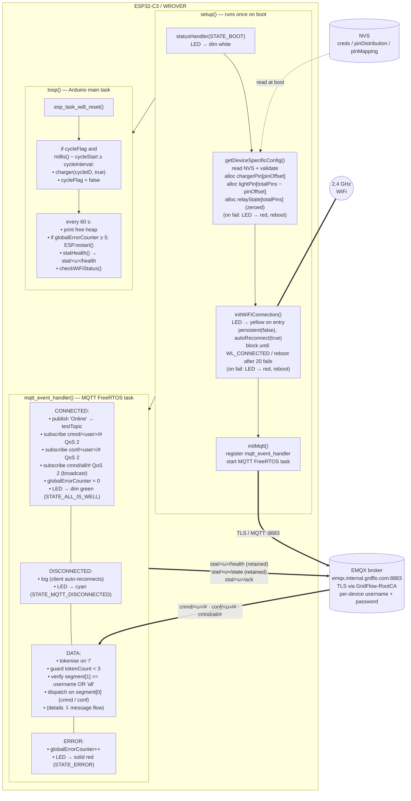
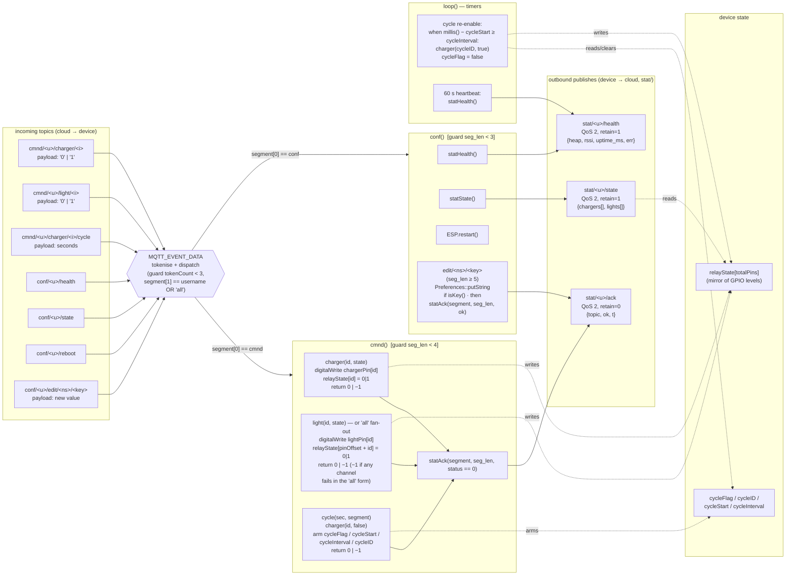

# GridFlow Microcontroller Firmware — Documentation

> **Status: Functional, with `tele` and a few hardening items outstanding.** The WiFi + TLS-MQTT infrastructure is live, the structured `MQTT_EVENT_DATA` router is active, and the `cmnd`, `conf`, and `stat` namespaces are all wired in. `cmnd` covers `charger`, `light` (including the `light/all` broadcast form), and `cycle` (now fully implemented); `conf` is live and covers `health`, `state`, `reboot`, and `edit` (currently only the `creds` NVS namespace is writable); `stat` is publish-only and exposes `statHealth()` / `statState()` / `statAck()`. A new `cmnd/all/#` broadcast subscription means commands addressed to the literal device ID `all` are accepted by every device. Periodic `statHealth()` runs from the 60 s `loop()` heartbeat; every actioned `cmnd` and every `conf/edit` publishes a `stat/<dev>/ack`. Outstanding: `tele` is still a header-only stub (no sensors connected), automatic `statState()` on relay change is not wired, and several smaller items are listed in [Section 15](#15-what-is-not-yet-implemented).
>
> **Current dev-time behaviour:** Inside `MQTT_EVENT_DATA` the topic is tokenised on `/` into `segment[]` (guard `tokenCount < 3`), the device-ID is verified against `username` **or the literal `"all"`** (broadcast addressing), and dispatch runs on `segment[0]` — `cmnd → cmnd()` and `conf → conf()`. The broker subscriptions established in `MQTT_EVENT_CONNECTED` are `cmnd/<username>/#`, `conf/<username>/#`, and `cmnd/all/#`, all at QoS 2. The legacy `cmd(payload)` debug handler in `src/cmd.cpp` is no longer reached — the call site inside `MQTT_EVENT_DATA` is wrapped in a `/* DEPRECIATED */` block and retained only as a marker that the path was deliberately retired.

---

## Table of Contents

1. [Project Overview](#1-project-overview)
2. [Hardware](#2-hardware)
3. [Project Structure](#3-project-structure)
4. [Build Configuration — `platformio.ini`](#4-build-configuration--platformioini)
5. [Global Configuration — `config.h` / `config.cpp`](#5-global-configuration--configh--configcpp)
6. [Entry Point — `main.cpp`](#6-entry-point--maincpp)
7. [WiFi Utilities — `src/wifiUtils/`](#7-wifi-utilities--srcwifiutils)
8. [MQTT Manager — `src/mqttManager/`](#8-mqtt-manager--srcmqttmanager)
9. [Topic Routing — `src/functions/`](#9-topic-routing--srcfunctions)
10. [Status LED — `src/statusManager/`](#10-status-led--srcstatusmanager)
11. [Debug Command Handler — `src/cmd.cpp`](#11-debug-command-handler--srccmdcpp)
12. [Architecture — How It All Fits Together](#12-architecture--how-it-all-fits-together)
13. [NVS Provisioning](#13-nvs-provisioning)
14. [MQTT Topic Structure](#14-mqtt-topic-structure)
15. [What Is Not Yet Implemented](#15-what-is-not-yet-implemented)

---

## 1. Project Overview

This is the firmware for a **GridFlow (GrdFlo) IoT node** running on an ESP32 microcontroller. The firmware is compatible with both the **ESP32-C3-DevKitM-1** and the **ESP32 WROVER** — the two boards are largely interchangeable for this firmware with the exception of the onboard RGB LED (see [Section 2](#2-hardware)). Development is currently being done on the **ESP32-C3**. The device:

- Connects to a WiFi network.
- Connects to the GridFlow MQTT broker (`emqx.internal.grdflo.com`) over **TLS** (port 8883), authenticating with a device-specific username and password.
- Receives commands and publishes status/telemetry through a structured MQTT topic hierarchy: `cmnd/`, `stat/`, `tele/`, and `conf/`.
- Controls a relay module (up to 16 channels) via GPIO — managing EV charging circuits and lighting circuits. The number of channels in use, the GPIO pin assignments, and the split between charger and light channels are all fully configurable at provisioning time. The same firmware binary runs on any hardware wiring configuration without recompilation.
- Stores all sensitive credentials and hardware configuration (WiFi SSID, WiFi password, device ID, MQTT password, pin assignments) in **ESP32 NVS** (Non-Volatile Storage), so they never appear in the firmware binary itself.

---

## 2. Hardware

### Supported Boards

The firmware runs on either of these two boards — they are interchangeable for all features except the onboard RGB LED:

| Board | MCU | Notes |
|---|---|---|
| **ESP32-C3-DevKitM-1** | ESP32-C3 (RISC-V, single-core) | Current development board. Has an onboard WS2812 RGB LED with **GRB** byte order. |
| **ESP32 WROVER** | ESP32 (Xtensa LX6, dual-core) | Production target option. Includes external SPI PSRAM. No LED connected for now. |

Each board has its own PlatformIO environment in `platformio.ini`. Switch between them by commenting/uncommenting the relevant `[env:...]` block. Both environments use the same pioarduino platform and the same source code.

### GPIO Pin Assignments

| Constant    | Where defined | GPIO | Purpose                                   |
|-------------|---------------|------|-------------------------------------------|
| `LED_PIN`   | `src/statusManager/statusManager.h` | 10 | Onboard addressable RGB LED (WS2812) — drives the operational status indicator |
| `RED_PIN`   | `src/config.h` | 21 | External red indicator LED / output (currently parked on bricked pin) |
| `BLUE_PIN`  | `src/config.h` | 21 | External blue indicator LED / output (currently parked on bricked pin) |

These are fixed indicator pins — not relay channels. `LED_PIN` lives in `statusManager.h` because that is the only module that drives it; `RED_PIN` / `BLUE_PIN` stay in `config.h` because legacy debug paths still reference them.

> **GRB quirk (ESP32-C3 only):** The onboard RGB LED on the ESP32-C3-DevKitM-1 uses **GRB** byte order instead of the usual RGB. The `rgbLedWrite()` calls in `statusManager.cpp` (and the legacy `cmd.cpp`) account for this — the second argument is Green, third is Red, fourth is Blue. So `rgbLedWrite(LED_PIN, 0, 255, 0)` produces **red**, not green. The WROVER has no LED on this pin, so all the `rgbLedWrite()` calls are harmless no-ops on that board. See [Section 10](#10-status-led--srcstatusmanager) for the full status palette.

> **Hardware note from pnv:** GPIO 21 on the original dev board is damaged. `RED_PIN` and `BLUE_PIN` are deliberately both pointed at 21 (`#define BLUE_PIN 21 // i know it is bricked`) so the legacy `cmd.cpp` debug commands cannot accidentally drive a working relay channel while the indicator-pin design is in flux.

### Relay Module

The device drives a relay module for controlling charging and lighting circuits. The channels are divided into two groups:

- **Charger pins** (`chargerPin[]`) — relay channels that switch EV charging or battery charging circuits.
- **Light pins** (`lightPin[]`) — relay channels that switch lighting circuits.

The total number of channels physically connected to GPIO (`totalPins`), the charger/light split (`pinOffset`), and the actual GPIO number for each channel are not hardcoded anywhere in the firmware. They are stored in NVS and loaded at boot. This means the supervisor's requirement — that pin count and pin assignments must be configurable without touching the firmware — is fully met. See [Section 5](#5-global-configuration--configh--configcpp) for the complete design.

> **Relay contact logic — important.** The relay module on this device is wired such that:
>
> - **GPIO `HIGH` → relay coil de-energised → NC (Normally Closed) contact is connected.**
> - **GPIO `LOW`  → relay coil energised   → NO (Normally Open) contact is connected.**
>
> Every `digitalWrite()` in `charger()` and `light()`, and the boot-time `digitalWrite(chargerPin[i], HIGH)` in `config.cpp`, should be read with that mapping in mind. The firmware never talks about "energised/closed" in the abstract — it drives a GPIO level and the contact (NC vs NO) follows from the wiring above. The charger boot state of HIGH therefore parks the relays on their **NC** contact with the coil **de-energised** (see [Section 5, Step 5](#step-5--pin-mapping-pinmapping-namespace)).

---

## 3. Project Structure

```
grdflo-microcontroller/
│
├── platformio.ini                  # PlatformIO build + board configuration
│
├── src/                            # Main application source
│   ├── main.cpp                    # setup() and loop() — firmware entry point
│   ├── config.h                    # Global constants, pin defs, extern declarations
│   ├── config.cpp                  # Global variable definitions + NVS credential/pin loading
│   ├── cmd.h                       # Declaration for the legacy debug cmd() function
│   ├── cmd.cpp                     # Legacy debug command handler (no longer reached at runtime)
│   │
│   ├── statusManager/
│   │   ├── statusManager.h         # Status state codes + LED_PIN definition + statusHandler() decl
│   │   └── statusManager.cpp       # rgbLedWrite() driver for the onboard WS2812 status LED
│   │
│   ├── wifiUtils/                  # WiFi connect + runtime health check (calls statusHandler)
│   │   ├── wifiUtils.h
│   │   ├── initWiFiConnection.cpp  # Blocking WiFi connect with reboot-on-failure
│   │   └── checkWiFiStatus.cpp     # Periodic WiFi health check + reconnect
│   │
│   ├── mqttManager/
│   │   ├── mqttManager.h           # Public API: initMqtt(), mqttPublish()
│   │   └── mqttManager.cpp         # MQTT client setup, event handler, topic tokeniser
│   │
│   └── functions/                  # Handlers for each MQTT root topic
│       ├── cmnd/
│       │   ├── cmnd.h              # cmnd() + charger() declarations, extern cycleID
│       │   └── cmnd.cpp            # charger/light/cycle relay control + cycle globals + ack on exit
│       ├── stat/
│       │   ├── stat.h              # statHealth() / statAck() / statState() declarations
│       │   └── stat.cpp            # JSON publishers — device → cloud, retained where appropriate
│       ├── tele/
│       │   └── tele.h              # Declaration for tele() handler — no .cpp yet
│       └── conf/
│           ├── conf.h              # Declaration for conf() handler
│           └── conf.cpp            # health/state/reboot read commands + edit (NVS write) + ack
│
├── lib/                            # (Empty — previously held wifiUtils; moved to src/ so statusManager is reachable)
├── include/                        # (Empty — reserved for shared project headers)
└── test/                           # (Empty — reserved for unit tests)
```

---

## 4. Build Configuration — `platformio.ini`

Two environments are defined — one per supported board. Both are currently uncommented and active. Active development is on the **C3-DevKitM-1**; the WROVER environment is present and compiles but has no additional hardware wired.

**ESP32-C3-DevKitM-1 environment (current dev board):**
```ini
[env:esp32-c3-devkitm-1]
platform = https://github.com/pioarduino/platform-espressif32/releases/download/stable/platform-espressif32.zip
board = esp32-c3-devkitm-1
framework = arduino
monitor_speed = 115200
board_build.partitions = min_spiffs.csv
build_flags =
    -DARDUINO_USB_CDC_ON_BOOT=1
    -DARDUINO_USB_MODE=1
```

**ESP32 WROVER environment:**
```ini
[env:wrover]
platform = https://github.com/pioarduino/platform-espressif32/releases/download/stable/platform-espressif32.zip
board = esp32dev
framework = arduino
monitor_speed = 115200
board_build.partitions = min_spiffs.csv
build_flags = -DBOARD_HAS_PSRAM
```

Neither environment currently pulls in any third-party `lib_deps` — the firmware uses only Arduino + ESP-IDF APIs. The previous `bblanchon/ArduinoJson@7.4.2` pin was removed entirely from both environments once it became clear the `stat/` payloads are small fixed-shape JSON strings built directly with `snprintf` (see [Section 9](#statstatcpp)), so a full JSON library is not warranted today.

### Key points

Settings common to both environments:

| Setting | Explanation |
|---|---|
| `platform = ...pioarduino...` | Uses the **pioarduino** fork of the ESP32 PlatformIO platform, which tracks newer ESP-IDF releases than the official Espressif platform package. |
| `framework = arduino` | Uses the Arduino-on-ESP-IDF layer. You can call standard `Arduino.h` functions AND drop into raw ESP-IDF APIs (like `esp_mqtt_client_*`, `esp_task_wdt_*`). |
| `monitor_speed = 115200` | Serial monitor baud rate — must match `Serial.begin(115200)` in `main.cpp`. |
| `board_build.partitions = min_spiffs.csv` | Partition table that allocates minimal space for SPIFFS, giving the application partition more flash. No filesystem is used here — all configuration lives in NVS. |

Settings that differ between boards:

| Setting | C3 | WROVER | Why |
|---|---|---|---|
| `board` | `esp32-c3-devkitm-1` | `esp32dev` | Different board profiles for different MCUs. |
| `-DARDUINO_USB_CDC_ON_BOOT=1` | ✓ present | ✗ absent | The C3-DevKitM-1 uses USB CDC for serial output (no separate UART chip). The WROVER has a hardware UART, so this flag is not needed. |
| `-DARDUINO_USB_MODE=1` | ✓ present | ✗ absent | Same reason — puts the C3's USB peripheral into CDC/ACM mode. |
| `-DBOARD_HAS_PSRAM` | ✗ absent | ✓ present | Enables PSRAM support for the WROVER's external SPI RAM. Harmless on modules without PSRAM. |

---

## 5. Global Configuration — `config.h` / `config.cpp`

These two files together define all the **global state** of the device.

### `config.h` — Declarations

```cpp
#define RED_PIN      21
#define BLUE_PIN     21    // i know it is bricked
#define MAX_SEGMENT   6
```

- `RED_PIN` / `BLUE_PIN`: GPIO numbers for the legacy external indicator pins. Both currently point at the bricked GPIO 21 — see [Section 2](#2-hardware) for the reason.
- `MAX_SEGMENT`: The maximum number of `/`-separated segments the firmware will parse from an incoming MQTT topic string. A topic like `cmnd/GF-B1/charger/0/cycle` has 5 segments; the upper bound of 6 accommodates the longest currently-routed form (`cmnd/<dev>/charger/<id>/cycle`).

(`LED_PIN` lives in `src/statusManager/statusManager.h` rather than here — it is only used by the status-LED driver, so keeping it inside that module reduces the public surface of `config.h`.)

The header also `extern`-declares every global variable that other `.cpp` files need to access:

```cpp
extern const char* ca_cert;            // TLS root certificate (PEM format)
extern unsigned int globalErrorCounter; // MQTT error count — triggers reboot at 5

extern String ssid;                    // WiFi network name — loaded from NVS
extern String wifiPassword;            // WiFi password — loaded from NVS

extern const char* brokerUri;          // MQTT broker URI
extern const char* testTopic;          // Dev/test MQTT topic ("test") used for the online announce
extern String username;                // Device ID — MQTT client ID and username
extern String password;                // MQTT password for this device

extern u8_t pinOffset;                 // How many of totalPins are charger channels
extern u8_t totalPins;                 // Total relay channels physically wired to GPIO
extern int *chargerPin;                // Dynamically allocated array of charger relay GPIO numbers
extern int *lightPin;                  // Dynamically allocated array of light relay GPIO numbers
extern int *relayState;                // Dynamically allocated mirror of current relay levels (0/1)

extern unsigned long cycleInterval;    // Cycle-command duration in ms (set by cycle())
extern unsigned long cycleStart;       // millis() timestamp when cycle was armed
extern bool cycleFlag;                 // true while a cycle is in flight
```

**Why `extern`?** Without it, every `.cpp` file that includes `config.h` would create its own separate copy of each variable — multiple definitions of the same symbol. The linker would either error or silently give each file its own independent variable, meaning changes in one file would not be visible in another. `extern` separates the *declaration* (which goes in the header — "this variable exists somewhere") from the *definition* (which goes in a `.cpp` — "this is the one actual variable in memory"). Every file that includes `config.h` gets a reference to the same single underlying variable, with no duplication and no wasted memory.

**Where the definitions actually live.** Most of these globals are defined in `config.cpp`. The three cycle-related globals — `cycleInterval`, `cycleStart`, `cycleFlag` — are defined in `src/functions/cmnd/cmnd.cpp` alongside the `cycle()` function that owns them. They are still declared `extern` in `config.h` so `main.cpp` can read them in `loop()`. There is also a `cycleID` integer (the charger index currently being cycled) declared `extern` in `cmnd.h` and defined in `cmnd.cpp` — kept out of `config.h` because only `cmnd.cpp` and the loop's cycle-watcher need it.

**Why pointers for `chargerPin`, `lightPin`, and `relayState`?** The size of these arrays is only known at boot time after reading `totalPins` and `pinOffset` from NVS. A fixed-size declaration like `int chargerPin[16]` would always allocate 16 integers regardless of how many relay channels are actually connected — wasting memory. Dynamic allocation with `new int[pinOffset]`, `new int[totalPins - pinOffset]`, and `new int[totalPins]()` sizes them to exactly what this particular deployment needs.

**`relayState` layout.** `relayState[0 .. pinOffset-1]` mirrors the chargers (same index as the channel ID in `cmnd/<dev>/charger/<i>`). `relayState[pinOffset .. totalPins-1]` mirrors the lights (with a `pinOffset` offset to translate `lightID` → mirror index). The allocation uses `new int[totalPins]()` — the trailing `()` value-initialises every element to 0. Writes happen inside `charger()` and `light()` immediately after each `digitalWrite`, so during normal operation the mirror stays in sync with the actual GPIO levels. `statState()` reads from this mirror, so it does not need to call `digitalRead` 16 times to publish the snapshot.

> **Boot-state mismatch.** `relayState` is zeroed at allocation, but charger GPIOs are immediately driven `HIGH` inside the pin-mapping loop (see Step 5). `relayState` is NOT updated during that `digitalWrite` — only `charger()` and `light()` write to it. This means between boot and the first `cmnd` that processes a charger, `relayState[0..pinOffset-1]` reports `0` (LOW) while the physical GPIOs are actually `HIGH` (NC contact). A `conf/<dev>/state` request arriving before any `cmnd` will therefore return inaccurate charger state in the snapshot.

### `config.cpp` — Definitions and NVS Loading

#### `ca_cert`

A **hardcoded PEM-encoded X.509 certificate** for the GridFlow internal Root CA (`GridFlow-RootCA`). The firmware embeds it so the TLS stack can verify the broker's identity without relying on any public CA store.

- Issuer/Subject: `GridFlow-RootCA`, country `NP`
- Valid: 2026-05-29 to 2036-05-26
- Self-signed CA certificate (CA:true) — GridFlow operates its own private PKI.

#### `brokerUri`

```cpp
const char* brokerUri = "mqtts://emqx.internal.grdflo.com:8883";
```

- `mqtts://` — MQTT over TLS.
- `emqx.internal.grdflo.com` — internal (private network) EMQX broker.
- Port `8883` — the standard MQTTS port.

#### `testTopic`

```cpp
const char* testTopic = "test";
```

Development placeholder used as the topic for the "Online" announce in `MQTT_EVENT_CONNECTED`. The real per-device control topic (see [Section 14](#14-mqtt-topic-structure)) is **already** built at runtime from `username` and subscribed to as `cmnd/<username>/#` — `testTopic` only remains for the boot-time online ping and will be removed once the `stat/` namespace is finalised.

#### `globalErrorCounter`

```cpp
unsigned int globalErrorCounter = 0;
```

Counts MQTT-level errors raised via `MQTT_EVENT_ERROR`. The 60-second tick in `loop()` checks this counter and reboots the device if it has reached 5, so a long-lived broker problem self-recovers without manual intervention. The counter is reset to 0 inside `MQTT_EVENT_CONNECTED`, so a successful reconnect after a transient error clears the error budget.

---

#### `getDeviceSpecificConfig()`

This is the most important function in this file. It reads all device-specific configuration out of NVS across three separate namespaces, validates everything, then allocates and populates the relay pin arrays. It runs once during `setup()` and reboots the device on any failure — a device with missing or invalid configuration cannot function, and a reboot loop makes the problem immediately visible on the serial monitor.

```cpp
void getDeviceSpecificConfig() {
    Preferences prefs;   // local variable — lives only for the duration of this function
    ...
}
```

`Preferences prefs` is declared as a **local variable** inside the function rather than as a global. It is only needed once during boot, so there is no reason to keep it in RAM for the entire lifetime of the device.

---

**Step 1 — Credentials (`creds` namespace)**

```cpp
prefs.begin("creds", true);

ssid         = prefs.getString("wifi_ssid", "readError");
wifiPassword = prefs.getString("wifi_pass", "readError");
username     = prefs.getString("dev_id",    "readError");
password     = prefs.getString("mqtt_pass", "readError");

prefs.end();
```

**NVS namespace `creds` — keys and meanings:**

| NVS Key     | Loaded into     | Meaning                                      |
|-------------|-----------------|----------------------------------------------|
| `wifi_ssid` | `ssid`          | WiFi network name                            |
| `wifi_pass` | `wifiPassword`  | WiFi password                                |
| `dev_id`    | `username`      | Device unique ID — also the MQTT client ID   |
| `mqtt_pass` | `password`      | MQTT password for this device on the broker  |

---

**Step 2 — Pin distribution (`pinDistribution` namespace)**

```cpp
prefs.begin("pinDistribution", true);
pinOffset = prefs.getUChar("offset",   255);
totalPins = prefs.getUChar("totalPin", 255);
prefs.end();
```

**NVS namespace `pinDistribution` — keys and meanings:**

| NVS Key    | Loaded into  | Meaning                                                      |
|------------|--------------|--------------------------------------------------------------|
| `offset`   | `pinOffset`  | How many of the connected relay channels are for charging    |
| `totalPin` | `totalPins`  | Total number of relay channels physically wired to GPIO      |

`totalPins` is the number of relay channels actually connected on this unit — the relay module supports up to 16 but a deployment might only wire up 4, 8, or any number. `pinOffset` is the split point within those connected channels: indices `0` to `pinOffset-1` go to the `chargerPin` array, indices `pinOffset` to `totalPins-1` go to `lightPin`.

**Why `getUChar` and not `getChar`?** `getChar` returns `int8_t` (signed, range -128 to 127). Passing `255` as the default would silently overflow to `-1` inside an `int8_t`. `getUChar` returns `uint8_t` (unsigned, range 0 to 255), so the default sentinel `255` is stored and returned correctly.

---

**Step 3 — Validation and reboot**

```cpp
if(ssid.compareTo("readError") == 0 || wifiPassword.compareTo("readError") == 0 ||
   username.compareTo("readError") == 0 || password.compareTo("readError") == 0 ||
   totalPins > 16 || pinOffset > totalPins) {
    statusHandler(STATE_ERROR);
    Serial.println("Could not get appropriate read value from NVS...");
    delay(5000);
    ESP.restart();
}
```

The 5-second delay before `ESP.restart()` gives the operator time to read the failure message and see the LED turn solid red before the reboot loop continues — invaluable for diagnosing a misprovisioned device from the serial monitor.

- Any credential string still equal to `"readError"` means the key was missing from NVS.
- `totalPins > 16` catches both the `255` not-found sentinel and any physically impossible value (the relay module only has 16 channels). Since `255 > 16` is true, a missing `totalPin` key always triggers a reboot — no separate sentinel check needed.
- `pinOffset > totalPins` catches a logically invalid configuration where more charger channels are declared than there are connected pins.

---

**Step 4 — Dynamic array allocation**

```cpp
chargerPin = new int[pinOffset];
lightPin   = new int[totalPins - pinOffset];
```

Arrays are sized at runtime to exactly what this deployment needs. A unit with `totalPins = 4` and `pinOffset = 2` allocates 4 integers total — 2 for chargers, 2 for lights — nothing wasted.

---

**Step 5 — Pin mapping (`pinMapping` namespace)**

```cpp
prefs.begin("pinMapping", true);

char tmp[2] = {0};

// Load charger GPIO numbers — NVS keys "A", "B", "C", ... for pinOffset entries
for(counter = 65; counter < (65 + pinOffset); counter++) {
    tmp[0] = (char)counter;
    tmp[1] = '\0';
    chargerPin[i] = prefs.getUChar(tmp, 255);

    if(chargerPin[i] == 255) { ... ESP.restart(); }
    pinMode(chargerPin[i], OUTPUT);
    digitalWrite(chargerPin[i], HIGH);   // park charger on NC contact (coil de-energised) at boot
    i++;
}
i = 0;

// Light GPIO numbers — NVS keys continue from where charger left off, up to totalPins
for(counter; counter < (65 + totalPins); counter++) {
    tmp[0] = (char)counter;
    tmp[1] = '\0';
    lightPin[i] = prefs.getUChar(tmp, 255);

    if(lightPin[i] == 255) { ... ESP.restart(); }
    pinMode(lightPin[i], OUTPUT);
    i++;
}

prefs.end();
```

The actual GPIO numbers for each relay channel are stored in NVS under single-character keys. Starting from `"A"` (ASCII 65), each successive key maps to the next relay channel in order. Only `totalPins` keys need to exist — unused relay positions on the module do not need NVS entries.

**Boot state — chargers are explicitly parked, lights take the Arduino default.** After `pinMode(chargerPin[i], OUTPUT)` the code calls `digitalWrite(chargerPin[i], HIGH)` for every charger pin. Per the [relay contact logic in Section 2](#relay-module), HIGH drives the coil **de-energised**, which parks the relay on its **NC (Normally Closed)** contact. The corresponding loop for `lightPin[]` deliberately omits the explicit `digitalWrite` — light pins take the Arduino default of `LOW` straight out of `pinMode`, which energises the coil and seats the relay on its **NO (Normally Open)** contact. The asymmetry is a deliberate safe-state at power-on: a charger sitting on its NC contact will not start delivering current the instant the GPIO peripheral comes online, before the WiFi / MQTT / `cmnd` stack has finished initialising and the cloud has had a chance to assert a desired state. Lights are considered safe to come up on NO and were not given the same treatment.

**Why single-character keys?** NVS key names must be short (max 15 characters). Single characters are the most compact option and perfectly sufficient for up to 16 channels (`"A"` through `"P"`).

**How the two loops stay in sync:** The first loop ends with `counter = 65 + pinOffset`. The second loop starts from that value and ends at `65 + totalPins`. The number of iterations in the second loop is `(65 + totalPins) - (65 + pinOffset) = totalPins - pinOffset`, which is exactly the size of the `lightPin` array. The split point cancels out algebraically — no matter how `pinOffset` changes, the two loops together always cover exactly `totalPins` keys.

**NVS key mapping:**

| NVS Key range | Maps to | Contains |
|---|---|---|
| `"A"` to key at `64 + pinOffset` | `chargerPin[0]` … `chargerPin[pinOffset-1]` | GPIO numbers for charger relays |
| Key at `65 + pinOffset` to key at `64 + totalPins` | `lightPin[0]` … `lightPin[totalPins-pinOffset-1]` | GPIO numbers for light relays |

If any key returns the sentinel `255` (meaning the key doesn't exist), the device reboots. A partially provisioned pin map would silently drive the wrong GPIO pins — hard rebooting is far safer.

**Why NVS for all of this?** Hardcoding credentials and pin assignments in the firmware binary is a security and flexibility problem. The binary can be extracted from flash and read. Different hardware variants would require maintaining separate firmware builds. By storing everything in NVS (which supports per-device encryption via ESP32's eFuse-backed NVS encryption), every device has unique credentials and wiring without a firmware rebuild.

> The `nvs.csv` and `nvs.bin` files used to flash these values are intentionally **gitignored** (they contain real credentials and device-specific hardware config). See [Section 13](#13-nvs-provisioning).

---

## 6. Entry Point — `main.cpp`

This is the standard Arduino-style entry point with `setup()` (runs once on boot) and `loop()` (runs repeatedly).

### Watchdog Timer Setup

```cpp
esp_task_wdt_config_t wdt_cfg = {
  .timeout_ms     = 30000,
  .idle_core_mask = 0,
  .trigger_panic  = true
};
```

The **Task Watchdog Timer (TWDT)** is the firmware's self-recovery mechanism. If `loop()` ever gets stuck for more than **30 seconds** without calling `esp_task_wdt_reset()`, the watchdog fires and the device **panics and reboots**. `trigger_panic = true` produces a full ESP32 panic — it prints a register dump and stack trace to serial before rebooting, rather than silently resetting. This is invaluable for debugging hangs.

`esp_task_wdt_reconfigure()` applies this config, and `esp_task_wdt_add(NULL)` subscribes the Arduino main task to the watchdog.

### `setup()`

Runs once on power-on / reset. Execution order matters here:

1. **`statusHandler(STATE_BOOT)`** — First line. Sets the onboard status LED to dim white so the operator can see the device is alive even before Serial is up. See [Section 10](#10-status-led--srcstatusmanager) for the full palette.
2. **`Serial.begin(115200)`** — Start serial output for debugging.
3. **`pinMode(RED_PIN/BLUE_PIN, OUTPUT)`** — Configure the two legacy indicator GPIO pins as digital outputs.
4. **`esp_task_wdt_reconfigure() + esp_task_wdt_add(NULL)`** — Arm the watchdog before any network calls that could potentially hang.
5. **`getDeviceSpecificConfig()`** — Load all credentials and pin mapping from NVS. Reboots (with `STATE_ERROR` = solid red LED) on any failure.
6. **`delay(3000)`** — A 3-second pause letting hardware, the radio subsystem, and internal peripherals stabilise before making network calls.
7. **`initWiFiConnection(ssid, wifiPassword)`** — Sets the LED to `STATE_WIFI_CONNECTING` (yellow) internally, then connects. Blocks until connected or reboots after 20 failed attempts (with LED on `STATE_ERROR`).
8. **`initMqtt()`** — Start the MQTT client. Flips the LED to `STATE_MQTT_CONNECTING` (orange) on entry, then returns immediately. The LED stays orange until `MQTT_EVENT_CONNECTED` fires in the background and flips it to `STATE_ALL_IS_WELL` (dim green).

### `loop()`

Runs continuously after `setup()`. It has two responsibilities — pet the watchdog and run two independent non-blocking timers:

```cpp
void loop() {
  esp_task_wdt_reset();
  unsigned long currMillis = millis();

  if(cycleFlag) {
    if((currMillis - cycleStart) >= cycleInterval) {
      Serial.printf("Cycle fired: charger %d re-enabling after %lu ms\n", cycleID, cycleInterval);
      charger(cycleID, true);
      cycleFlag = false;
    }
  }

  if((currMillis - prevMillis) >= interval) {
    prevMillis = currMillis;
    Serial.printf("Free heap: %d bytes\n", ESP.getFreeHeap());

    if(globalErrorCounter >= 5) {
      ESP.restart();
    }
    statHealth();
    checkWiFiStatus(ssid.c_str(), wifiPassword.c_str());
  }
}
```

The `millis()` / timestamp pattern is a **non-blocking interval timer** — it avoids `delay()`, which would block the watchdog reset and eventually trigger a panic.

**Cycle re-enable block.** `cycleFlag` is set by `cycle()` in `cmnd.cpp` when a cycle command arrives. `cycle()` turns the targeted charger OFF, records `cycleStart = millis()` and the requested duration `cycleInterval` (in ms), and remembers which charger via `cycleID`. The loop then watches that timestamp: when `currMillis - cycleStart >= cycleInterval`, the charger is turned back ON and the flag is cleared. Unsigned subtraction makes this rollover-safe past the 49-day `millis()` wrap. Only one cycle can be in flight at a time — see [Section 9](#9-topic-routing--srcfunctions).

**60-second heartbeat.** Every minute the loop prints free heap (slow memory-leak detection), checks the error-counter budget, publishes a `statHealth()` snapshot to `stat/<dev>/health` (retained, QoS 2 — see [Section 9](#statstatcpp)), and calls `checkWiFiStatus()` to recover from WiFi loss. The retained health publish means a dashboard subscribing mid-stream immediately sees the latest snapshot; the periodic re-publish gives the cloud a continuous time-series for trending heap leaks, RSSI drift, and accumulating MQTT errors.

**Error-counter reboot.** `globalErrorCounter` is incremented from `MQTT_EVENT_ERROR` in the MQTT task and reset to 0 from `MQTT_EVENT_CONNECTED`. If it crosses the threshold of 5 between two heartbeat ticks without a successful reconnect resetting it, the device hard-reboots via `ESP.restart()`. This is the application-layer self-recovery for cases where the MQTT client is producing errors but the WiFi link itself looks healthy.

---

## 7. WiFi Utilities — `src/wifiUtils/`

Connection helpers used at startup and periodically thereafter. Previously lived under `lib/wifiUtils/` as a PlatformIO static library, but was moved into `src/` so it can `#include "statusManager/statusManager.h"` and update the status LED on connect / drop. (A library under `lib/` would need explicit `lib_deps` plumbing to see headers in `src/`.) It provides two functions.

### `initWiFiConnection(ssid, password)` — `initWiFiConnection.cpp`

Blocking WiFi connection used at startup. Entry sets the LED to `STATE_WIFI_CONNECTING` (yellow) so the operator can see "we're trying" during the up-to-10-second wait. On failure the LED is set to `STATE_ERROR` (solid red) just before the reboot, so an operator watching a bricked board sees red-flash → reboot → red-flash in a loop, which is the on-site signal for "WiFi credentials are wrong / AP is gone".

```cpp
statusHandler(STATE_WIFI_CONNECTING);
WiFi.setAutoReconnect(true);   // ← must be before WiFi.begin()
WiFi.persistent(false);        // ← must be before WiFi.begin()
WiFi.begin(ssid, password);
```

Both settings are applied **before** `WiFi.begin()`. This matters:

- **`setAutoReconnect(true)`**: Tells the ESP32 WiFi driver to automatically attempt reconnection when the link drops, without any application-layer intervention. This is the primary reconnection mechanism. Setting it after `begin()` may not apply cleanly to the already-started connection.
- **`WiFi.persistent(false)`**: Prevents the WiFi library from writing the SSID/password to a second flash region on every `WiFi.begin()` call. Since credentials already live in NVS, writing them again is redundant and burns unnecessary flash write cycles. If called after `begin()`, the first call may have already written to flash.

The function then polls `WiFi.status()` in a loop — up to 20 attempts at 500 ms each (10 seconds total). Each failed attempt prints a `.` to serial so the progress is visible. If WiFi does not connect in time, the device **reboots** — there is no meaningful work it can do without network connectivity.

On success, the connected SSID and assigned IP address are printed to serial.

### `checkWiFiStatus(ssid, password)` — `checkWiFiStatus.cpp`

Called from `loop()` every 60 seconds as an **application-level WiFi watchdog**.

```cpp
void checkWiFiStatus(const char *ssid, const char *password) {
    if (WiFi.status() != WL_CONNECTED) {
        statusHandler(STATE_WIFI_CONNECTING);
        Serial.println("WiFi lost, reconnecting...");
        WiFi.disconnect();
        WiFi.begin(ssid, password);
    }
}
```

This is a safety net on top of `setAutoReconnect(true)`. If the driver-level reconnect fails or gets stuck in a bad state, this manually forces a fresh `WiFi.begin()`. The status LED flips back to yellow so an operator can see the device is in a reconnect attempt, not in a steady-state failure. The `Serial.println` before the reconnect attempt makes WiFi loss events clearly visible in the monitor log too.

There is intentionally **no** "WiFi-came-back" branch here that resets the LED to green. Once WiFi reconnects, the MQTT client notices its keepalive failing and re-handshakes; the `MQTT_EVENT_CONNECTED` callback is what flips the LED back to dim green. This keeps the LED honest: yellow stays on while the *full network stack* is still rebuilding, not just the radio.

---

## 8. MQTT Manager — `src/mqttManager/`

This is the heart of the firmware's connectivity layer. It uses the **ESP-IDF native MQTT client** (`esp_mqtt_client_*`) directly — not the Arduino PubSubClient library. The native client is more capable: it supports MQTT 5, QoS 0/1/2, TLS out of the box, message queuing (outbox), and runs on its own FreeRTOS task.

### `mqttManager.h` — Public API

```cpp
void initMqtt();
void mqttPublish(const char* pubTopic, const char *message, const int QoS, const int retain, const bool store);
```

- `initMqtt()`: Call once from `setup()`. Configures and starts the MQTT client.
- `mqttPublish()`: Used by the rest of the application to publish messages to the broker.

The commented-out `mqttSubscribe()` suggests dynamic per-topic subscription was considered — subscriptions are currently hardcoded inside `MQTT_EVENT_CONNECTED`.

### `mqttManager.cpp` — Implementation

#### `client`

```cpp
esp_mqtt_client_handle_t client;
```

A file-scope global handle to the MQTT client instance. Stored at file scope so both `mqtt_event_handler` and `mqttPublish` can access it without passing it around.

---

#### `initMqtt()`

Sets the status LED to `STATE_MQTT_CONNECTING` (orange) at entry — the LED stays orange from the moment WiFi is up and the MQTT client is being configured, until `MQTT_EVENT_CONNECTED` flips it to dim green. This is the live call site for that state code (see [Section 10](#10-status-led--srcstatusmanager)).

Builds the MQTT client configuration struct and starts the client:

```cpp
esp_mqtt_client_config_t mqtt_cfg = {};
mqtt_cfg.session.keepalive                        = 20;
mqtt_cfg.broker.address.uri                       = brokerUri;
mqtt_cfg.credentials.client_id                    = username.c_str();
mqtt_cfg.credentials.username                     = username.c_str();
mqtt_cfg.credentials.authentication.password      = password.c_str();
mqtt_cfg.broker.verification.certificate          = ca_cert;
```

Key design decisions:

- **`client_id` == `username`**: The device ID serves double duty — it uniquely identifies the MQTT session AND authenticates it. The EMQX broker's ACL rules can use this to restrict each device to publishing and subscribing only on its own topics.
- **`keepalive = 20`**: The client sends a PINGREQ to the broker every 20 seconds of inactivity. The broker disconnects a client that goes silent for longer than `keepalive × 1.5 = 30 s`. This deliberately aligns with the 30-second watchdog timeout — if the device hangs and the watchdog fires, the broker will also notice the silence and mark the device offline.
- **`ca_cert`**: Passed directly to the ESP-IDF TLS stack. The stack verifies the broker's certificate chain against this CA. If verification fails, the connection is refused — no MITM possible.

**Commented-out Last Will block:**

```cpp
// mqtt_cfg.session.last_will.topic   = "test";
// mqtt_cfg.session.last_will.msg     = "{\"status\":\"offline\"}";
// mqtt_cfg.session.last_will.msg_len = 0;   // 0 -> strlen
// mqtt_cfg.session.last_will.qos     = 1;
// mqtt_cfg.session.last_will.retain  = 1;
```

This is the **MQTT Last Will and Testament (LWT)**. When configured, the broker automatically publishes this message if the client disconnects unexpectedly (power loss, crash, network failure). It is the standard IoT pattern for device presence detection — the cloud knows the device went offline without the device having to explicitly say so. It is commented out because the final `stat/` topic structure is not yet finalised.

---

#### `mqtt_event_handler()`

This is a **FreeRTOS event handler callback** — it runs on the MQTT client's internal FreeRTOS task whenever an MQTT event occurs. The handled events:

**`MQTT_EVENT_CONNECTED`**

```cpp
Serial.println("Connected to GridFlow EMQX Server");
esp_mqtt_client_enqueue(client, testTopic, "GF-KD1-Test --> Online", 0, 0, 0, true);

String cmndTopic = "cmnd/" + username + "/#";
esp_mqtt_client_subscribe(client, cmndTopic.c_str(), 2);

String confTopic = "conf/" + username + "/#";
esp_mqtt_client_subscribe(client, confTopic.c_str(), 2);

esp_mqtt_client_subscribe(client, "cmnd/all/#", 2);

globalErrorCounter = 0;
statusHandler(STATE_ALL_IS_WELL);
```

When the client successfully connects to the broker:
1. Prints a confirmation to serial.
2. Publishes a retained "Online" announcement to the dev `testTopic` ("test").
3. Builds the per-device wildcard subscription `cmnd/<username>/#` at runtime and subscribes at QoS 2 (exactly-once delivery). This catches every `cmnd/<this-device>/...` topic the broker routes to it, including the `cycle` subtopics.
4. Subscribes to `conf/<username>/#` at QoS 2 (health/state/reboot/edit requests).
5. Subscribes to `cmnd/all/#` at QoS 2. This is the **broadcast** channel — any cloud-side publisher can address every device in the fleet at once by publishing to `cmnd/all/...` (e.g. `cmnd/all/light/0` with payload `"1"` turns on light channel 0 on every connected device). The device-ID check inside `MQTT_EVENT_DATA` accepts `segment[1] == "all"` in addition to its own `username`, so the same `cmnd()` dispatch handles broadcast and per-device commands uniformly.
6. Resets `globalErrorCounter` to 0 — a successful (re)connect clears the error budget that drives the auto-reboot in `loop()`.
7. Calls `statusHandler(STATE_ALL_IS_WELL)` to flip the onboard status LED to dim green — the "everything is healthy" signal.

**`MQTT_EVENT_DISCONNECTED`**

Prints `"Disconnected from broker (auto-reconnecting...)"` and calls `statusHandler(STATE_MQTT_DISCONNECTED)` to flip the LED to cyan. The ESP-IDF MQTT client handles reconnection automatically — no manual reconnect code needed here. When the client eventually re-handshakes, `MQTT_EVENT_CONNECTED` fires and the LED returns to dim green.

**`MQTT_EVENT_SUBSCRIBED`**

Prints the message ID from the broker's SUBACK, confirming the subscription was accepted.

**`MQTT_EVENT_DATA`** — Incoming message handling.

This is the structured router. The topic is tokenised on `/` into a fixed-size `segment[]` array, the device-ID is verified, and the message is dispatched to the per-root handler. The legacy `cmd(payload)` debug call now lives in a `/* ... */` block beneath the router and is no longer reached.

```cpp
case MQTT_EVENT_DATA: {
    Serial.printf("Message Received in topic %.*s: ", event->topic_len, event->topic);
    Serial.printf("%.*s\n", event->data_len, event->data);

    char topic[event->topic_len + 1];
    memcpy(topic, event->topic, event->topic_len);
    topic[event->topic_len] = '\0';

    char *segment[MAX_SEGMENT];
    size_t tokenCount = 0;
    char *savePtr;
    char *token = strtok_r(topic, "/", &savePtr);
    while(token != NULL && tokenCount < MAX_SEGMENT) {
        segment[tokenCount++] = token;
        token = strtok_r(NULL, "/", &savePtr);
    }

    if (tokenCount < 3) return;

    char payload[event->data_len + 1];
    memcpy(payload, event->data, event->data_len);
    payload[event->data_len] = '\0';

    if(strcmp(segment[1], username.c_str()) == 0 || strcmp(segment[1], "all") == 0) {
        if(strcmp(segment[0], "cmnd") == 0) cmnd(segment, tokenCount, payload);
        if(strcmp(segment[0], "conf") == 0) conf(segment, tokenCount, payload);
    } else {
        Serial.println("Client ID Mismatch");
    }

    /*
    DEPRECIATED
    cmd(payload);
    */

    break;
}
```

**Why manual null-termination?** The ESP-IDF MQTT event struct gives you `event->topic` (a raw pointer) and `event->topic_len` (an integer length). The pointer points into an internal buffer that is **not** null-terminated. Standard C string functions like `strtok_r` and `strcmp` require null-terminated strings, so the code manually copies the data into local stack arrays and appends `'\0'`. The initial `Serial.printf` avoids this copy by using `%.*s`, which takes an explicit length instead of relying on a null terminator.

**Why `tokenCount < 3`?** Every valid routable topic has at least 3 segments — `<root>/<dev>/<sub>`. `conf/<dev>/health`, `conf/<dev>/state`, and `conf/<dev>/reboot` are exactly 3 segments and must be allowed through. Handlers that need `segment[3]` (every `cmnd` path; `conf/edit`) do their own tighter check inside the handler — `cmnd()` enforces `seg_len < 4`, and `conf()`'s `edit` branch enforces `seg_len >= 5`.

**Topic routing logic:**
- `segment[0]` — the root namespace: `cmnd`, `stat`, `tele`, or `conf`.
- `segment[1]` — the device ID, verified against `username` **or** the literal string `"all"`. The `"all"` match is what makes `cmnd/all/...` work as a fleet-wide broadcast — see the `MQTT_EVENT_CONNECTED` subscription list above.
- `segment[2+]` — sub-topic levels passed to the handler for further dispatch.

Both `cmnd` and `conf` dispatches are live. `stat` and `tele` are device-to-cloud only and have no dispatch lines — the device never receives its own `stat/` publishes and `tele/` has no handler yet.

**Device-ID filter is active, with a broadcast escape hatch.** Because the broker subscriptions are `cmnd/<this-device>/#`, `conf/<this-device>/#`, and `cmnd/all/#`, the broker should never deliver a non-`all` message addressed to another device. The `segment[1] == username || segment[1] == "all"` check is a defence-in-depth — if a misconfigured ACL or a wildcard subscription ever leaks another device's traffic to this client, the `Client ID Mismatch` log makes it visible.

**`MQTT_EVENT_ERROR`**

```cpp
case MQTT_EVENT_ERROR:
    statusHandler(STATE_ERROR);
    Serial.println("MQTT_EVENT_ERROR");
    globalErrorCounter++;
    break;
```

Flips the status LED to solid red, prints `"MQTT_EVENT_ERROR"`, and bumps `globalErrorCounter`. The actual error reason (TLS failure, connection refused, socket error) is available in `event->error_handle` but is not yet extracted and logged. The error-counter feeds the 60-second auto-reboot check in `loop()` — see [Section 6](#6-entry-point--maincpp). The LED stays red until either a successful reconnect (`MQTT_EVENT_CONNECTED` → green) or until the error-counter reboot fires (back to white via `STATE_BOOT`).

**`default`**

An explicit `default: break;` silently handles any other event IDs the client may emit.

---

#### `mqttPublish()`

```cpp
void mqttPublish(const char* pubTopic, const char *message, const int QoS, const int retain, const bool store) {
    esp_mqtt_client_enqueue(client, pubTopic, message, 0, QoS, retain, store);
}
```

A thin wrapper around `esp_mqtt_client_enqueue()`. Uses `enqueue` rather than `publish` — `enqueue` adds the message to the client's internal **outbox** (a persistent queue), which means:
- If the connection drops mid-publish, the message is retried automatically when the client reconnects.
- It is safe to call from any FreeRTOS task, not just the MQTT task itself.

The `0` for the `len` parameter tells the library to calculate the length via `strlen(message)` automatically.

---

## 9. Topic Routing — `src/functions/`

These four subdirectories define the four root-level MQTT namespaces. The `cmnd`/`stat`/`tele` naming convention mirrors **Tasmota's topic design**, a widely adopted IoT communication pattern. `conf` is a GridFlow-specific addition for runtime device configuration.

The four namespaces divide into two roles based on direction:

**Input channels — device subscribes, cloud publishes:**

| Namespace | Purpose |
|-----------|---------|
| `cmnd` | Commands to the device — turn relay channels on or off |
| `conf` | Runtime configuration — update device settings without re-flashing NVS |

**Output channels — device publishes, cloud subscribes:**

| Namespace | Purpose |
|-----------|---------|
| `stat` | Device health and status — free heap, WiFi RSSI, uptime, and similar diagnostics |
| `tele` | Sensor telemetry — data from physical sensors connected to the device (sensors not yet connected) |

Each namespace has a corresponding C function with the same signature:

```cpp
void cmnd(char *segment[], const size_t seg_len, const char *payload);
void stat (char *segment[], const size_t seg_len, const char *payload);
void tele (char *segment[], const size_t seg_len, const char *payload);
void conf (char *segment[], const size_t seg_len, const char *payload);
```

- `segment[]`: The full array of `/`-split topic segments. Handlers can inspect `segment[2]`, `segment[3]`, etc. for sub-topic routing.
- `seg_len`: How many segments were actually parsed. Always bounds-check against this before accessing the array.
- `payload`: The null-terminated message payload string.

### `cmnd/cmnd.cpp`

The topic structures for `cmnd` are:

```
cmnd/<device_id>/(charger|light)/<channelID>          # on/off
cmnd/<device_id>/charger/<channelID>/cycle            # timed off-then-on
```

`segment[2]` selects the relay group (`charger` or `light`). `segment[3]` is either the zero-based channel index within that group — `0` through `pinOffset-1` for chargers, `0` through `totalPins-pinOffset-1` for lights — or the literal string `"all"` (currently supported on the `light` branch only — see "light/all broadcast" below). `segment[4]`, when present, selects a sub-command (currently only `cycle`).

`cmnd()` enforces its own `seg_len < 4` guard at the top (early return) — every routed path needs `segment[3]`. The broker-level guard in `mqttManager.cpp` is `< 3` (to allow 3-segment `conf/<dev>/health` etc. through to the conf handler), so the channel-index check has to be repeated here. After dispatch, the handler captures the integer return `status` (initialised to `-1`, set by whichever sub-handler runs) and publishes a single ack to `stat/<dev>/ack` summarising the result. The `charger` / `light` branches are chained with `else if`, so once one matches the other is not re-evaluated. A topic whose `segment[2]` is neither `"charger"` nor `"light"` falls into a default branch that returns **without** acking — the firmware deliberately does not confirm topics it silently dropped.

**`charger(int chargerID, bool state)`**
- Bounds-checks `chargerID >= pinOffset` and returns `-1` if out of range.
- Calls `digitalWrite(chargerPin[chargerID], HIGH/LOW)` based on `state`.
- Updates the state mirror: `relayState[chargerID] = state ? 1 : 0`.
- Logs `Charger <id> (GPIO <n>) -> ON/OFF` to serial.
- Returns `0` on success.

**`light(int lightID, bool state)`**
- Bounds-checks `lightID >= (totalPins - pinOffset)` and returns `-1` if out of range.
- Calls `digitalWrite(lightPin[lightID], HIGH/LOW)` based on `state`.
- Updates the state mirror: `relayState[pinOffset + lightID] = state ? 1 : 0` (lights live in the second half of `relayState[]`).
- Logs `Light <id> (GPIO <n>) -> ON/OFF`.
- Returns `0` on success.

**`light/all` broadcast.** When `segment[3]` is the literal string `"all"` on the light branch, `cmnd()` iterates every light channel and calls `light(i, state)` for each. If any single `light(i, state)` returns non-zero, the overall `status` is set to `-1` so the eventual ack reports `"ok": false`. The fleet-broadcast composition is therefore: publish `cmnd/all/light/all` with payload `"0"` and every device drops every light at once. The charger branch does not currently support the `"all"` channel form — only `light` does.

Both `segment[3]` and `payload` are passed through `atoi()` at the call site (when `segment[3]` is a numeric channel index) — `segment[3]` is the channel index as a string (e.g., `"2"`), and `payload` is `"1"` or `"0"`. `atoi()` converts both to integers; the integer `0`/`1` then implicitly converts to `bool` for the `state` parameter. The `"all"` form is detected as a string compare before the `atoi` path.

> **Payload caveat:** `atoi()` returns 0 for any non-numeric string. So `"1"` → ON, `"0"` → OFF, but `"ON"` / `"OFF"` / `"on"` / `"off"` all parse as 0 and turn the relay OFF. Use numeric payloads only, or replace the `atoi()` parse with `strcmp()` / JSON if word-form payloads need to be supported.

Example: `cmnd/GF-B1/charger/1` with payload `"1"` → `state=true` → `digitalWrite(chargerPin[1], HIGH)` — per the [relay contact logic](#relay-module), HIGH parks the relay on its **NC contact** (coil de-energised). Sets `relayState[1] = 1`, then publishes `stat/GF-B1/ack` with `{"topic":"cmnd/GF-B1/charger/1","ok":true,"t":<ms>}`. Payload `"0"` → `state=false` → `LOW` → **NO contact** (coil energised).

**`cycle(unsigned int timeInSeconds, char *segment[])`** — timed off-then-on cycle for one charger channel. Used to drop and re-energise a charger after a fixed delay (e.g. to reset a downstream device or to throttle current draw).

- Topic: `cmnd/<dev>/charger/<id>/cycle`
- Payload: integer **seconds** (the delay between off and re-on). The payload is multiplied by 1000 to give the internal `cycleInterval` in ms.

The arming sequence inside `cycle()`:
1. Parse `chargerID` from `segment[3]`.
2. Call `charger(chargerID, false)` to drop the relay. **If this returns non-zero (bad chargerID), return early with that status** — the cycle is not armed and the eventual ack will be `ok:false`.
3. Set `cycleFlag = true`, record `cycleID = chargerID`, `cycleStart = millis()`, `cycleInterval = timeInSeconds * 1000`.
4. Log `Cycle started: charger <id>, interval <ms> ms`.
5. Return `0`.

The re-enable happens **outside** this function, in `main.cpp`'s `loop()`. The loop watches `cycleFlag` and, when `millis() - cycleStart >= cycleInterval`, re-energises the charger via `charger(cycleID, true)` and clears the flag. This split keeps `cycle()` non-blocking — the MQTT task returns immediately and the watchdog is unaffected even for long cycle durations.

Note: the ack for a cycle command means **"cycle armed successfully"**, not "cycle completed". The re-energise log line (`Cycle fired: charger N re-enabling after <ms> ms`) is the observable signal that the timer fired.

Constraints to know about:
- **One cycle at a time.** `cycleFlag` / `cycleID` / `cycleStart` / `cycleInterval` are scalars, so a second cycle command (on any charger) while a first is in flight overwrites the first one's bookkeeping — the first charger never gets re-enabled. If concurrent cycles per channel are ever needed, these globals have to become per-channel arrays.
- **Cycle is only valid for chargers**, not lights. Sending `cmnd/<dev>/light/<id>/cycle` does not match the dispatch.
- **Guard tightness.** The handler accepts the cycle path when `seg_len >= 5`. A malformed `cmnd/<dev>/charger/<id>/cycle` with no payload (or a non-numeric payload) parses to a 0-ms cycle, which the loop will fire on the very next iteration — visible as an off-then-on flicker.

**Ack flow.** Whatever path the dispatcher takes (charger / light / cycle), `cmnd()` ends with a single call:
```cpp
statAck(segment, seg_len, status == 0);
```
The `(segment, seg_len)` overload of `statAck()` rebuilds the original topic from the still-valid segment pointers (the `strtok_r` mutilation only consumed the slash bytes), so the ack body always names the exact topic that was acted on. Topics that don't match any branch (`segment[2]` neither `"charger"` nor `"light"`) return early **without** acking, on the principle that you don't want to confirm a topic the firmware silently dropped.

### `conf/conf.cpp`

`conf` is the cloud-to-device control channel for things that aren't relay toggles: status pulls, runtime config edits, and operational commands like reboot. The topic structures:

```
conf/<device_id>/health                                # request → device publishes stat/<id>/health
conf/<device_id>/state                                 # request → device publishes stat/<id>/state
conf/<device_id>/reboot                                # ESP.restart()
conf/<device_id>/edit/<namespace>/<key>     payload=<value>   # NVS write, then ack
```

The handler has its own `seg_len < 3` guard at entry (all four subcommands need at least `conf/<dev>/<sub>`), then dispatches on `segment[2]`:

- **`"health"`** → calls `statHealth()`. The retained `stat/<dev>/health` publish *is* the response — no separate ack.
- **`"state"`** → calls `statState()`. Same pattern — the retained state snapshot is the response.
- **`"reboot"`** → calls `ESP.restart()`. The device will not get a chance to ack; the cloud-side signal that the reboot worked is the next `MQTT_EVENT_CONNECTED` and the corresponding "Online" publish.
- **`"edit"`** → checks `seg_len >= 5`, then writes `payload` to NVS namespace `segment[3]`, key `segment[4]` (currently only the `creds` namespace is wired up, using `Preferences::putString`). The handler only writes if `pref.isKey()` confirms the key already exists — this prevents accidentally creating arbitrary NVS keys via a typo. Returns `ok = true` if both the namespace match and the key check pass, then publishes `stat/<dev>/ack` summarising the result.

Example: `conf/GF-B1/edit/creds/wifi_pass` with payload `"NewPassword"` updates the WiFi password in NVS and acks. The change does **not** take effect until the next reboot — `WiFi.begin()` is only called from `setup()`. Pairing it with `conf/GF-B1/reboot` is the way to roll out a live credential change.

> **Security note.** `conf/edit` can rewrite WiFi credentials, MQTT password, and device ID via NVS. The broker ACL on `conf/<dev>/edit/#` needs to be considerably tighter than the ACL on `cmnd/<dev>/#` — only operators with rotation privileges should be able to publish there. Read-only operators only need publish access to `conf/<dev>/health` and `conf/<dev>/state`.

### `stat/stat.cpp`

`stat` is the device-to-cloud publish channel. The handler file is not invoked from `mqtt_event_handler` (stat is publish-only — see the architecture diagram in [Section 12](#12-architecture--how-it-all-fits-together)); it instead exposes three functions called by `cmnd()`, `conf()`, and (eventually) the `loop()` heartbeat.

| Function | Topic | QoS | Retain | Caller |
|---|---|---|---|---|
| `statHealth()` | `stat/<dev>/health` | 2 | yes | 60 s `loop()` heartbeat; on-demand via `conf/<dev>/health` |
| `statState()` | `stat/<dev>/state` | 2 | yes | `conf/<dev>/state` request; planned: every relay change |
| `statAck(...)` | `stat/<dev>/ack` | 2 | no | every `cmnd` and every `conf/edit` |

**Retain choices:**
- `health` and `state` are **retained** so a freshly-subscribing dashboard immediately sees the latest snapshot without waiting for the next publish.
- `ack` is **not retained** because each ack describes a one-shot event in the past — a new subscriber being greeted by an hour-old ack would be misleading.

**Payload schemas** (built via `snprintf`, not ArduinoJson, since the shapes are fixed and the payloads are small):

```jsonc
// stat/<dev>/health
{"heap": 234560, "rssi": -52, "uptime_ms": 873912, "err": 0}

// stat/<dev>/state — chargers[] is pinOffset entries, lights[] is totalPins-pinOffset entries
{"chargers": [0, 1], "lights": [1, 0]}

// stat/<dev>/ack
{"topic": "cmnd/GF-B1/charger/1", "ok": true, "t": 873912}
```

`statAck()` is overloaded:
- `statAck(const char *originTopic, bool ok)` — direct topic string.
- `statAck(char *segment[], size_t seg_len, bool ok)` — rebuilds the original topic by joining segments with `/` and forwards to the first form. This is what `cmnd()` and `conf()` actually call, since they only have access to the post-`strtok_r` segments.

### `tele/tele.h`

Header-only declaration with no `.cpp` implementation file yet. The sub-topic structure for `tele` will be defined when physical sensors are connected.

> **Note on future sensor support:** When physical sensors are added to the device, their GPIO pin assignments will likely need to be added to the NVS provisioning system similarly to how `chargerPin` and `lightPin` are handled today. The `conf/<dev>/edit/...` namespace plus `getDeviceSpecificConfig()` will both need extending at that point.

---

## 10. Status LED — `src/statusManager/`

The onboard WS2812 RGB LED on GPIO 10 (ESP32-C3-DevKitM-1 only — the WROVER does not have one wired) is driven as an at-a-glance operational indicator. The point is to be able to walk up to a deployed device on-site and immediately tell what state it is in without serial monitor or MQTT access.

### State codes

Defined in `statusManager.h` as `#define` constants:

| Code | Name | Color | Meaning |
|------|------|-------|---------|
| `0`   | `STATE_BOOT`              | dim white | Set at the very top of `setup()`, before anything else |
| `1`   | `STATE_WIFI_CONNECTING`   | yellow    | Set inside `initWiFiConnection()` and `checkWiFiStatus()` while attempting to (re)connect |
| `2`   | `STATE_MQTT_CONNECTING`   | orange    | Set at the top of `initMqtt()` — WiFi is up and the MQTT client is being configured / handshaking; cleared by `MQTT_EVENT_CONNECTED` flipping the LED to dim green |
| `3`   | `STATE_MQTT_DISCONNECTED` | cyan      | `MQTT_EVENT_DISCONNECTED` — link to broker dropped, client is retrying |
| `4`   | `STATE_ALL_IS_WELL`       | dim green | `MQTT_EVENT_CONNECTED` — full stack healthy |
| `255` | `STATE_ERROR`             | solid red | Any unrecoverable error path — NVS validation failure, WiFi failure (about-to-reboot), `MQTT_EVENT_ERROR` |

A single solid-red state covers all error paths intentionally: NVS-fail, WiFi-fail, and MQTT-error are not distinguishable on-site by colour alone anyway — they're distinguished by *when* they appear (reboot loop = NVS, fails immediately after yellow = WiFi, fails after green = MQTT).

### GRB byte order

The WS2812 LED on the C3-DevKitM-1 receives its bytes in **GRB** order. The Arduino `rgbLedWrite(pin, a, b, c)` API takes `a = green, b = red, c = blue`. So:

| Color | `rgbLedWrite(LED_PIN, G, R, B)` |
|-------|---------------------------------|
| dim white | `(50, 50, 50)` |
| yellow    | `(100, 100, 0)` — green + red, no blue |
| orange    | `(40, 150, 0)` — red-heavy with a touch of green |
| cyan      | `(100, 0, 100)` — green + blue, no red |
| dim green | `(30, 0, 0)` |
| solid red | `(0, 255, 0)` |

The trap: `rgbLedWrite(LED_PIN, 0, 255, 0)` produces **red**, not green. The second arg is the R channel.

### `statusHandler(u8_t statusCode)`

The only public function. Switch-cases on the state code and writes the corresponding GRB triple to `LED_PIN` via `rgbLedWrite()`. Each call is one-shot — it sets the LED and returns. There is no animation tick, no background task, no state machine — calling `statusHandler(STATE_ERROR)` writes red once and the LED stays red until something else calls `statusHandler(...)` with a different state. The function is safe to call from any FreeRTOS task; concurrent calls might briefly tear the LED state but that resolves within one frame.

### Call sites

| Location | Call | When |
|----------|------|------|
| `main.cpp::setup()` (first line) | `statusHandler(STATE_BOOT)` | Very start of boot |
| `config.cpp::getDeviceSpecificConfig()` × 3 reboot blocks | `statusHandler(STATE_ERROR)` | NVS validation or pinMapping read failure |
| `wifiUtils/initWiFiConnection.cpp` entry | `statusHandler(STATE_WIFI_CONNECTING)` | Before the blocking connect loop |
| `wifiUtils/initWiFiConnection.cpp` reboot branch | `statusHandler(STATE_ERROR)` | After 20 failed connect attempts |
| `wifiUtils/checkWiFiStatus.cpp` | `statusHandler(STATE_WIFI_CONNECTING)` | Runtime WiFi loss detected (called from the 60 s `loop()` tick) |
| `mqttManager.cpp::initMqtt()` entry | `statusHandler(STATE_MQTT_CONNECTING)` | MQTT client being configured / handshake in flight |
| `mqttManager.cpp` MQTT_EVENT_CONNECTED | `statusHandler(STATE_ALL_IS_WELL)` | Broker handshake succeeded |
| `mqttManager.cpp` MQTT_EVENT_DISCONNECTED | `statusHandler(STATE_MQTT_DISCONNECTED)` | Broker connection dropped |
| `mqttManager.cpp` MQTT_EVENT_ERROR | `statusHandler(STATE_ERROR)` | MQTT-level error event |

### Recovery transitions

There is no explicit "WiFi-came-back" or "we-just-fixed-it" call site. Recovery is implicit: when WiFi reconnects, the MQTT client eventually re-handshakes, `MQTT_EVENT_CONNECTED` fires, and that call resets the LED to dim green. This means after a network blip you may briefly see yellow / cyan / red until the full stack is healthy again — which is the honest behaviour.

### Why this module looks slim

An earlier iteration had a blink animation for the error state, driven from a `statusTick()` called per `loop()` iteration. That was removed because the only blinking state (`STATE_ERROR`) was already unambiguous as solid red — adding a tick + state flag + 1 Hz timer was carrying complexity for zero information. The current ~30-line `statusManager.cpp` is the simplest thing that does the job.

### WROVER compatibility

`LED_PIN = 10` is hard-coded for the C3-DevKitM-1's onboard LED. On the WROVER, GPIO 10 has nothing connected — `rgbLedWrite()` still runs through the RMT peripheral but produces no visible output. Safe to leave as-is; future WROVER hardware revisions can wire a status LED to GPIO 10 with no firmware change.

---

## 11. Debug Command Handler — `src/cmd.cpp`

> **Current status: both `cmd.h` and `cmd.cpp` are entirely commented out.** Every line in both files is inside a block comment. The files are retained as a historical reference for what the original debug commands were; nothing in them compiles or runs. `main.cpp` and `mqttManager.cpp` still `#include "cmd.h"` but since the header is fully commented the include is a no-op.

The `cmd()` function was an **earlier, simpler command handler** that predated the structured `cmnd`/`stat`/`tele`/`conf` routing. It accepted a raw payload string and dispatched on it directly with no topic-level routing. The original payloads it handled were: `"reboot"` (hard reboot), `"red"` / `"blue"` / `"green"` / `"white"` / `"off"` (RGB LED control), `"rp"` / `"bp"` (RED_PIN/BLUE_PIN HIGH), `"gr"` (both HIGH), `"off_pin"` / `"on_pin"` (both LOW/HIGH).

The call site `cmd(payload)` inside `MQTT_EVENT_DATA` is in a `/* DEPRECIATED */` block and also does not compile since the function is no longer declared. These files will likely be deleted in a future cleanup pass.

---

## 12. Architecture — How It All Fits Together

Two diagrams: the **system topology** below shows the three execution contexts (`setup()`, the Arduino `loop()` task, and the MQTT client FreeRTOS task) plus the external resources they touch (NVS, WiFi, the broker). The **message dispatch flow** further down zooms into what happens to each incoming topic — which handler runs, what state it mutates, and what gets published back.

### System topology



### Message dispatch flow

This diagram traces every supported topic from arrival through dispatch into the per-handler functions, the device state they touch, and the outbound publish each one produces.



A few invariants this picture encodes:

- Every successful path through `cmnd()` ends in a single `statAck()` — there's only one ack per inbound `cmnd` message, regardless of which sub-function (charger/light/cycle) ran.
- The cycle re-enable is owned by `loop()`, **not** by `cycle()` — that's why the cycle-watcher is in its own subgraph and reads/clears the cycle bookkeeping that `cycle()` armed.
- `relayState[]` has three writers (`charger()`, `light()`, and the cycle-watcher in `loop()` via `charger()`) but only one reader on the publish side (`statState()`). It's the single source of truth for "what relays are currently on".
- `stat/...` topics are **publish only** for the device — there is no subscription on `stat/<u>/#`, so the device never sees its own retained state.
- The onboard status LED (driven via `statusHandler()` from `setup()`, both WiFi helpers, and all three MQTT events) is an **independent** side-channel — it does not appear in this dispatch flow because it is set as a side effect of the same code paths shown here. See [Section 10](#10-status-led--srcstatusmanager) for the colour-to-state mapping.

---

## 13. NVS Provisioning

NVS (Non-Volatile Storage) is an ESP32 key-value store in flash, in its own partition separate from the firmware. Before a device can be deployed, its NVS partition must be written with device-specific credentials and hardware configuration.

The typical workflow:

1. Create an `nvs.csv` file (gitignored) with rows for each key-value pair across all three namespaces:

   ```
   key,type,encoding,value
   creds,namespace,,
   wifi_ssid,data,string,MyWiFiNetwork
   wifi_pass,data,string,MyWiFiPassword
   dev_id,data,string,GF-B1
   mqtt_pass,data,string,MyMqttPassword
   pinDistribution,namespace,,
   totalPin,data,u8,4
   offset,data,u8,2
   pinMapping,namespace,,
   A,data,u8,0
   B,data,u8,1
   C,data,u8,2
   D,data,u8,3
   ```

   In this example: `totalPin = 4` (4 relay channels physically wired), `offset = 2` (channels A and B are chargers on GPIO 0 and 1; channels C and D are lights on GPIO 2 and 3). Only `totalPin` keys are needed in `pinMapping` — there is no need to provision relay positions that are not physically connected.

2. Use the `nvs_partition_gen.py` tool (from ESP-IDF) to produce `nvs.bin`:
   ```bash
   python nvs_partition_gen.py generate nvs.csv nvs.bin 0x6000
   ```

3. Flash `nvs.bin` to the NVS partition address using `esptool.py` or a PlatformIO custom target.

Both `nvs.csv` and `nvs.bin` are in `.gitignore` because they contain real WiFi credentials, MQTT passwords, and device-specific hardware configuration. They must never be committed.

### Complete NVS Key Reference

| Namespace | Key | Type | Meaning |
|---|---|---|---|
| `creds` | `wifi_ssid` | string | WiFi network name |
| `creds` | `wifi_pass` | string | WiFi password |
| `creds` | `dev_id` | string | Device unique ID — also used as MQTT client ID and username |
| `creds` | `mqtt_pass` | string | MQTT password for this device on the broker |
| `pinDistribution` | `totalPin` | u8 | Number of relay channels physically wired (1–16) |
| `pinDistribution` | `offset` | u8 | Number of those channels used for charging (0–totalPin) |
| `pinMapping` | `A` through `A+totalPin-1` | u8 | GPIO number for each relay channel in order |

---

## 14. MQTT Topic Structure

All topics follow the same top-level pattern:

```
<root>/<device_id>/<subtopic...>
```

Where:
- `<root>` is one of `cmnd`, `stat`, `tele`, `conf`
- `<device_id>` is `username` (= `dev_id` from NVS) — e.g., `GF-B1`
- `<subtopic...>` is one or more additional levels handled inside each routing function

The **segment array** passed to each handler maps as:

```
topic:    cmnd  /  GF-B1  /  charger  /  1
index:      0       1          2          3
```

So `segment[0]` = root, `segment[1]` = device ID, `segment[2+]` = action-specific path.

### `cmnd` topic structure

```
cmnd/<device_id>/(charger|light)/<channelID>          # on/off
cmnd/<device_id>/light/all                            # on/off, fan-out to every light channel
cmnd/<device_id>/charger/<channelID>/cycle            # timed off-then-on
cmnd/all/...                                          # fleet broadcast (any topic above, addressed to every device)
```

`<device_id>` may be either this device's own `username` (from NVS) or the literal string `"all"`. The broker subscription `cmnd/all/#` is added at every `MQTT_EVENT_CONNECTED`, so a publisher addressing `cmnd/all/light/0` reaches every connected device simultaneously and each one runs its own `cmnd()` dispatch.

| Topic | Payload | Direction | Meaning |
|-------|---------|-----------|---------|
| `cmnd/GF-B1/charger/0` | `"1"` / `"0"` | Cloud → Device | Set charger relay 0 ON / OFF |
| `cmnd/GF-B1/charger/1` | `"1"` / `"0"` | Cloud → Device | Set charger relay 1 ON / OFF |
| `cmnd/GF-B1/light/0`   | `"1"` / `"0"` | Cloud → Device | Set light relay 0 ON / OFF |
| `cmnd/GF-B1/light/1`   | `"1"` / `"0"` | Cloud → Device | Set light relay 1 ON / OFF |
| `cmnd/GF-B1/light/all` | `"1"` / `"0"` | Cloud → Device | Set **every** light channel ON / OFF on this device |
| `cmnd/GF-B1/charger/0/cycle` | `"<seconds>"` (e.g. `"5"`) | Cloud → Device | Drop charger 0, then re-energise after N seconds. Non-blocking. |
| `cmnd/all/light/all` | `"1"` / `"0"` | Cloud → **Every device** | Fleet broadcast: every device runs `light/all` |
| `cmnd/all/charger/<id>` | `"1"` / `"0"` | Cloud → **Every device** | Fleet broadcast: every device sets its own charger `<id>` to the given state |

Payload semantics: numeric only. `atoi()` is used for parsing, so `"ON"`/`"OFF"` parse as 0 and turn the relay OFF — use `"1"`/`"0"` for on/off, and a positive integer for `cycle`.

### `conf` topic structure

```
conf/<device_id>/health                                # request → device publishes stat/<id>/health
conf/<device_id>/state                                 # request → device publishes stat/<id>/state
conf/<device_id>/reboot                                # ESP.restart()
conf/<device_id>/edit/<namespace>/<key>     payload=<value>   # NVS write, then ack
```

| Topic | Payload | Direction | Meaning |
|-------|---------|-----------|---------|
| `conf/GF-B1/health` | (ignored) | Cloud → Device | Trigger an out-of-cycle health snapshot publish |
| `conf/GF-B1/state` | (ignored) | Cloud → Device | Trigger an out-of-cycle relay-state snapshot publish |
| `conf/GF-B1/reboot` | (ignored) | Cloud → Device | Soft reboot via `ESP.restart()` |
| `conf/GF-B1/edit/creds/wifi_pass` | `"<new password>"` | Cloud → Device | Write new value to NVS `creds` namespace, key `wifi_pass`; takes effect on next reboot |

### `stat` topic structure (device → cloud)

| Topic | QoS | Retain | Body | Trigger |
|-------|-----|--------|------|---------|
| `stat/GF-B1/health` | 2 | yes | `{"heap":<n>,"rssi":<dBm>,"uptime_ms":<n>,"err":<n>}` | 60 s `loop()` heartbeat; on-demand via `conf/<dev>/health` |
| `stat/GF-B1/state` | 2 | yes | `{"chargers":[0|1,...],"lights":[0|1,...]}` | `conf/<dev>/state` request |
| `stat/GF-B1/ack` | 2 | no | `{"topic":"<original topic>","ok":true|false,"t":<ms>}` | Every `cmnd` and every `conf/edit` |

### `tele` topic structure (not yet designed)

`tele/GF-B1/...` will carry physical sensor telemetry once sensors are wired up.

---

## 15. What Is Not Yet Implemented

| Component | File | Status | Notes |
|-----------|------|--------|-------|
| `tele` handler | `src/functions/tele/` | Header only | No `.cpp` file; sensors not yet connected; no dispatch line in `mqttManager.cpp` and no subscription |
| `relayState` boot sync | `config.cpp` / `cmnd.cpp` | Out of sync at power-on | Charger GPIOs are driven `HIGH` in `getDeviceSpecificConfig()` but `relayState[]` is zero-initialised and not updated there. A `conf/<dev>/state` before the first `cmnd` returns `0` for all chargers even though their GPIOs are `HIGH`. Fix: initialise `relayState[i] = 1` alongside each `digitalWrite(chargerPin[i], HIGH)` in the pin-mapping loop |
| Auto `statState()` on every relay change | `cmnd.cpp` `charger()` / `light()` | Not wired | Currently only published on `conf/<dev>/state` request. Calling `statState()` after each mutation would let dashboards stay in sync without polling |
| Per-channel cycle bookkeeping | `cmnd.cpp:7–10` | Single-slot only | `cycleFlag`/`cycleID`/`cycleStart`/`cycleInterval` are scalars — a second cycle command overwrites any in-flight cycle. Needs to become per-channel arrays if concurrent cycles are required |
| Cycle payload validation | `cmnd.cpp:18` | Loose | `seg_len >= 5` permits a cycle topic with no payload-seconds; `atoi()` parse falls through to 0 → instant flicker. Tighten to `seg_len >= 5 && atoi(payload) > 0` or use JSON when payload schema firms up |
| `conf/edit` namespace support | `conf.cpp` | Only `creds` wired | Only the `creds` namespace is writable today. `pinDistribution` and `pinMapping` writes need to be added (with revalidation of `offset <= totalPin` etc.) before runtime pin reconfig is possible |
| `conf/reboot` ack | `conf.cpp:27–30` | Intentional | `ESP.restart()` cannot ack — the cloud-side signal that the reboot worked is the next `MQTT_EVENT_CONNECTED` and the "Online" publish |
| Last Will (LWT) | `mqttManager.cpp:96–101` | Commented out | Pending final `stat/` topic structure — natural target is `stat/<dev>/online` with body `{"online":false}` |
| `MQTT_EVENT_ERROR` detail | `mqttManager.cpp:77–80` | Minimal | Prints event name and increments `globalErrorCounter` — actual reason from `error_handle` not extracted |
| MQTT init null check | `mqttManager.cpp:103` | Missing | `esp_mqtt_client_init()` return value not checked for NULL |
| VLA stack allocation | `mqttManager.cpp:39, 57` | Present | `topic` and `payload` are variable-length stack arrays — valid as a GCC extension but fragile under large MQTT payloads. Fixed-size buffers with explicit size checks would be safer |
| WDT reset in WiFi loop | `initWiFiConnection.cpp:9` | Missing | The blocking connect loop does not call `esp_task_wdt_reset()` — safe now (10 s < 30 s WDT), but fragile if the timeout or attempt count is ever increased |
| `stat/<dev>/online` boot announce | `mqttManager.cpp:20` | Placeholder | Boot "Online" still publishes to the dev `testTopic` (`"test"`) — should move to `stat/<username>/online` to match the rest of the `stat/` namespace and pair with the future LWT |
| Sensor support | — | Not started | `tele` is reserved for physical sensor data; pin mapping will need extending when sensors are added |
| OTA firmware update | — | Not started | Updates currently require physical USB access; ESP32 OTA support via `cmnd` is the planned approach |
| NVS encryption | — | Not started | Credentials currently stored in plaintext flash; ESP32 NVS encryption via eFuse-backed key is the production solution |
| Broker ACL hardening on `conf/edit` | broker side | Operational | `conf/<dev>/edit/creds/...` can rewrite WiFi/MQTT credentials — needs a much tighter ACL than `cmnd/<dev>/#` |

---

*End of documentation.*
